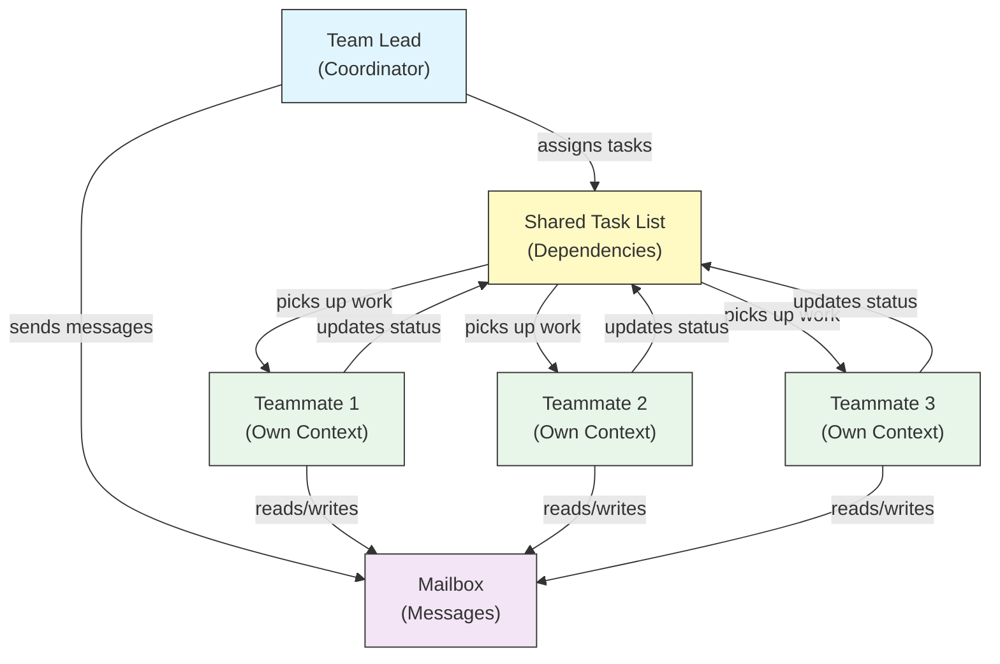

## Agent Teams (Experimental)

Agent Teams coordinate multiple Claude Code instances working together on complex tasks. Unlike subagents (which are delegated subtasks returning results), teammates work independently with their own context windows and can message each other directly through a shared mailbox system.

> **Official Documentation**: [code.claude.com/docs/en/agent-teams](https://code.claude.com/docs/en/agent-teams)

> **Note**: Agent Teams is experimental and disabled by default. Requires Claude Code v2.1.32+. Enable it before use.

### Subagents vs Agent Teams

| Aspect | Subagents | Agent Teams |
|--------|-----------|-------------|
| **Delegation model** | Parent delegates subtask, waits for result | Team lead coordinates work, teammates execute independently |
| **Context** | Fresh context per subtask, results distilled back | Each teammate maintains its own persistent context window |
| **Coordination** | Sequential or parallel, managed by parent | Shared task list with automatic dependency management |
| **Communication** | Results returned to parent only (no inter-agent messaging) | Teammates can message each other directly via mailbox |
| **Session resumption** | Supported | Not supported with in-process teammates |
| **Best for** | Focused, well-defined subtasks | Complex work requiring inter-agent communication and parallel execution |

### Enabling Agent Teams

Set the environment variable or add it to your `settings.json`:

```bash
export CLAUDE_CODE_EXPERIMENTAL_AGENT_TEAMS=1
```

Or in `settings.json`:

```json
{
  "env": {
    "CLAUDE_CODE_EXPERIMENTAL_AGENT_TEAMS": "1"
  }
}
```

### Starting a team

Once enabled, ask Claude to work with teammates in your prompt:

```
User: Build the authentication module. Use a team — one teammate for the API endpoints,
      one for the database schema, and one for the test suite.
```

Claude will create the team, assign tasks, and coordinate the work automatically.

### Display modes

Control how teammate activity is displayed:

| Mode | Flag | Description |
|------|------|-------------|
| **Auto** | `--teammate-mode auto` | Automatically chooses the best display mode for your terminal |
| **In-process** (default) | `--teammate-mode in-process` | Shows teammate output inline in the current terminal |
| **Split-panes** | `--teammate-mode tmux` | Opens each teammate in a separate tmux or iTerm2 pane |
| **iTerm2** | `--teammate-mode iterm2` | (v2.1.186+) Spawns teammates in dedicated iTerm2 panes. Requires the `it2` CLI; auto mode warns when it can't be found |

```bash
claude --teammate-mode tmux
```

You can also set the display mode in `settings.json`:

```json
{
  "teammateMode": "tmux"
}
```

> **Note**: Split-pane mode requires tmux or iTerm2. It is not available in VS Code terminal, Windows Terminal, or Ghostty.

### Navigation

Use `Shift+Down` to navigate between teammates in split-pane mode.

### Team Configuration

Team configurations are stored at `~/.claude/teams/{team-name}/config.json`.

### Teammate Model Selection

As of v2.1.234, the "Default teammate model" `/config` setting was removed. Teammates now inherit the team lead's model by default, unless the spawn call specifies a different model explicitly.

### Architecture



**Key components**:

- **Team Lead**: The main Claude Code session that creates the team, assigns tasks, and coordinates
- **Shared Task List**: A synchronized list of tasks with automatic dependency tracking
- **Mailbox**: An inter-agent messaging system for teammates to communicate status and coordinate
- **Teammates**: Independent Claude Code instances, each with their own context window

### Task assignment and messaging

The team lead breaks work into tasks and assigns them to teammates. The shared task list handles:

- **Automatic dependency management** — tasks wait for their dependencies to complete
- **Status tracking** — teammates update task status as they work
- **Inter-agent messaging** — teammates send messages via the mailbox for coordination (e.g., "Database schema is ready, you can start writing queries")

### Plan approval workflow

For complex tasks, the team lead creates an execution plan before teammates begin work. The user reviews and approves the plan, ensuring the team's approach aligns with expectations before any code changes are made.

### Hook events for teams

Agent Teams introduce two additional [hook events](../06-hooks/):

| Event | Fires When | Use Case |
|-------|-----------|----------|
| `TeammateIdle` | A teammate finishes its current task and has no pending work | Trigger notifications, assign follow-up tasks |
| `TaskCompleted` | A task in the shared task list is marked complete | Run validation, update dashboards, chain dependent work |

### Best practices

- **Team size**: Keep teams at 3-5 teammates for optimal coordination
- **Task sizing**: Break work into tasks that take 5-15 minutes each — small enough to parallelize, large enough to be meaningful
- **Avoid file conflicts**: Assign different files or directories to different teammates to prevent merge conflicts
- **Start simple**: Use in-process mode for your first team; switch to split-panes once comfortable
- **Clear task descriptions**: Provide specific, actionable task descriptions so teammates can work independently

### Limitations

- **Experimental**: Feature behavior may change in future releases
- **No session resumption**: In-process teammates cannot be resumed after a session ends
- **One team per session**: Cannot create nested teams or multiple teams in a single session
- **Fixed leadership**: The team lead role cannot be transferred to a teammate
- **Split-pane restrictions**: tmux/iTerm2 required; not available in VS Code terminal, Windows Terminal, or Ghostty
- **No cross-session teams**: Teammates exist only within the current session

> **Warning**: Agent Teams is experimental. Test with non-critical work first and monitor teammate coordination for unexpected behavior.

---
