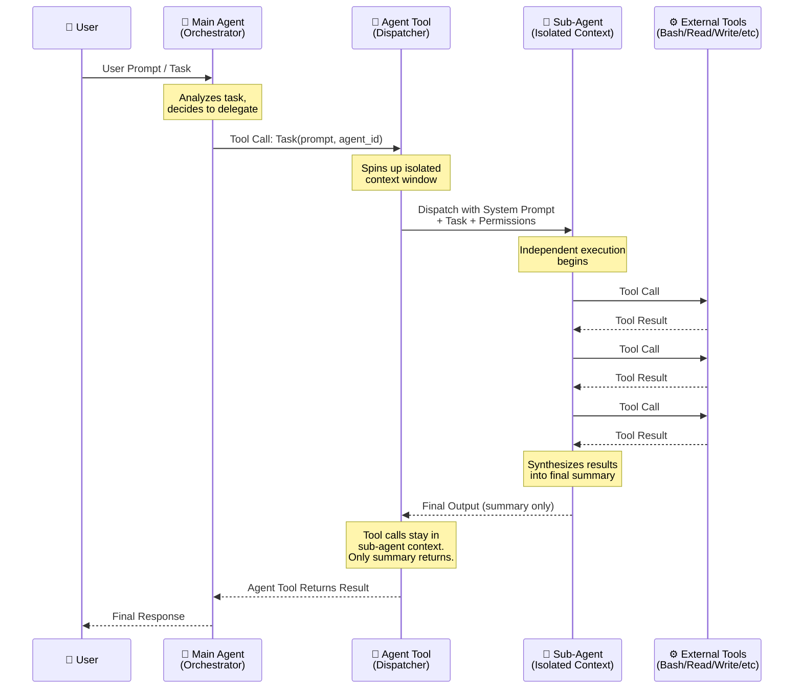

```mermaid
sequenceDiagram
    participant U as 👤 User
    participant A as 🤖 Main Agent<br/>(Orchestrator)
    participant T as 🔧 Agent Tool<br/>(Dispatcher)
    participant S as 🤖 Sub-Agent<br/>(Isolated Context)
    participant E as ⚙️ External Tools<br/>(Bash/Read/Write/etc)

    U->>A: User Prompt / Task

    Note over A: Analyzes task,<br/>decides to delegate

    A->>T: Tool Call: Task(prompt, agent_id)

    Note over T: Spins up isolated<br/>context window

    T->>S: Dispatch with System Prompt<br/>+ Task + Permissions

    Note over S: Independent execution<br/>begins

    S->>E: Tool Call #1 (e.g. Read file)
    E-->>S: Tool Result #1

    S->>E: Tool Call #2 (e.g. Bash cmd)
    E-->>S: Tool Result #2

    S->>E: Tool Call #N (e.g. Write file)
    E-->>S: Tool Result #N

    Note over S: Synthesizes results<br/>into final summary

    S-->>T: Final Output (summary only)

    Note over T: Tool calls stay in<br/>sub-agent context.<br/>Only summary returns.

    T-->>A: Agent Tool Returns Result

    A-->>U: Final Response
```