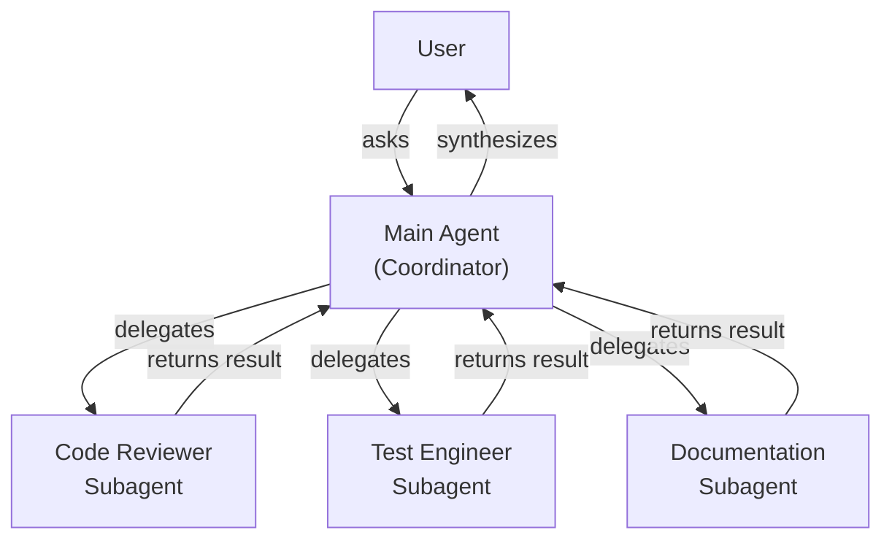
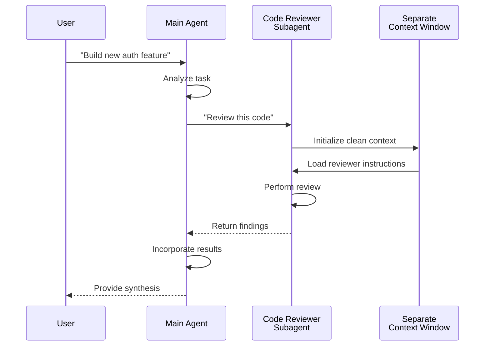
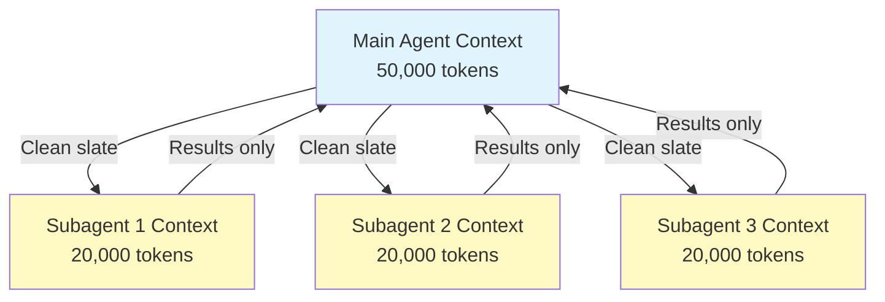
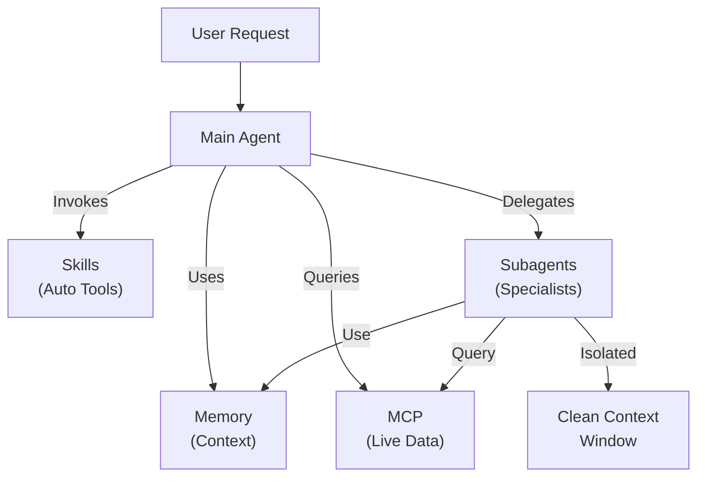
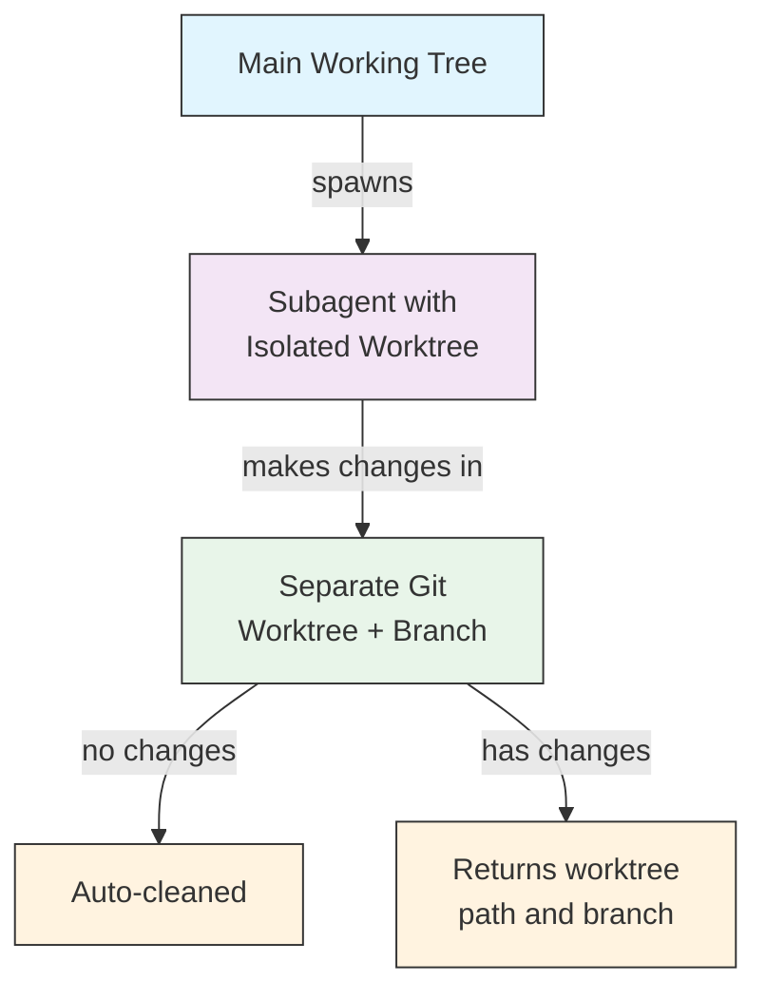

# Subagents

Subagents are specialized AI assistants that Claude Code can delegate tasks to. Each subagent has a specific purpose, uses its own context window separate from the main conversation, and can be configured with specific tools and a custom system prompt.

## Overview

Subagents enable delegated task execution in Claude Code by:

- Creating **isolated AI assistants** with separate context windows
- Providing **customized system prompts** for specialized expertise
- Enforcing **tool access control** to limit capabilities
- Preventing **context pollution** from complex tasks
- Enabling **parallel execution** of multiple specialized tasks

Each subagent operates independently with a clean slate, receiving only the specific context necessary for their task, then returning results to the main agent for synthesis.

---

## Key Benefits

| Benefit | Description |
|---------|-------------|
| **Context preservation** | Operates in separate context, preventing pollution of main conversation |
| **Specialized expertise** | Fine-tuned for specific domains with higher success rates |
| **Reusability** | Use across different projects and share with teams |
| **Flexible permissions** | Different tool access levels for different subagent types |
| **Scalability** | Multiple agents work on different aspects simultaneously |

---

<br/>
<br/>

---
## Configuration

### File Format

Subagents are defined in YAML frontmatter followed by the system prompt in markdown:

[Configuration Fields Reference](./subagent-configuration-fields.md)

```yaml
---
name: your-sub-agent-name
description: Description of when this subagent should be invoked
tools: tool1, tool2, tool3  # Optional - inherits all tools if omitted
disallowedTools: tool4  # Optional - explicitly disallowed tools
model: sonnet  # Optional - sonnet, opus, haiku, or inherit
permissionMode: default  # Optional - permission mode
maxTurns: 20  # Optional - limit agentic turns
skills: skill1, skill2  # Optional - skills to preload into context
mcpServers: server1  # Optional - MCP servers to make available
memory: user  # Optional - persistent memory scope (user, project, local)
background: false  # Optional - run as background task
effort: high  # Optional - reasoning effort (low, medium, high, xhigh, max)
isolation: worktree  # Optional - git worktree isolation
initialPrompt: "Start by analyzing the codebase"  # Optional - auto-submitted first turn
experimental:  # Optional - experimental settings block
  cacheTtl: "1h"  # Cache TTL for this subagent: "5m" or "1h" (v2.1.248+)
hooks:  # Optional - component-scoped hooks
  PreToolUse:
    - matcher: "Bash"
      hooks:
        - type: command
          command: "./scripts/security-check.sh"
---

Your subagent's system prompt goes here. This can be multiple paragraphs
and should clearly define the subagent's role, capabilities, and approach
to solving problems.
```

<br/>
<br/>
<br/>
<br/>


**Example — agent with `mcpServers` and `permissionMode`:**

```yaml
---
name: secure-researcher
description: Research agent with scoped MCP access and restricted permissions
permissionMode: acceptEdits
mcpServers:
  notion:
    type: http
    url: https://mcp.notion.com/mcp
  github:
    type: http
    url: https://api.github.com/mcp
tools: Read, Grep, Glob
---

You are a research agent. You may query Notion and GitHub through the
configured MCP servers, and read local files, but you cannot write or
execute commands outside of accepted edits.
```

<br/>
<br/>


### File Locations


Subagent files can be stored in multiple locations with different scopes:

| Priority | Type | Location | Scope |
|----------|------|----------|-------|
| 1 (highest) | **CLI-defined** | Via `--agents` flag (JSON) | Session only |
| 2 | **Project subagents** | `.claude/agents/` | Current project |
| 3 | **User subagents** | `~/.claude/agents/` | All projects |
| 4 (lowest) | **Plugin agents** | Plugin `agents/` directory | Via plugins |

When duplicate names exist, higher-priority sources take precedence.

> **Nested `.claude/` precedence (v2.1.178)**: When the same agent name is defined in multiple nested `.claude/agents/` directories (for example, a monorepo with package-level `.claude/` folders), the definition **closest to your current working directory wins**. The same closest-wins rule applies to nested workflow and output-style definitions.


<br/>
<br/>


---
## Tool Configuration Options

**Option 1: Inherit All Tools (omit the field)**
```yaml
---
name: full-access-agent
description: Agent with all available tools
---
```

**Option 2: Specify Individual Tools**
```yaml
---
name: limited-agent
description: Agent with specific tools only
tools: Read, Grep, Glob, Bash
---
```

**Option 3: Conditional Tool Access**
```yaml
---
name: conditional-agent
description: Agent with filtered tool access
tools: Read, Bash(npm:*), Bash(test:*)
---
```

<br/>
<br/>


---
## CLI-Based Configuration

Define subagents for a single session using the `--agents` flag with JSON format:

```bash
claude --agents '{
  "code-reviewer": {
    "description": "Expert code reviewer. Use proactively after code changes.",
    "prompt": "You are a senior code reviewer. Focus on code quality, security, and best practices.",
    "tools": ["Read", "Grep", "Glob", "Bash"],
    "model": "sonnet"
  }
}'
```

**JSON Format for `--agents` flag:**

```json
{
  "agent-name": {
    "description": "Required: when to invoke this agent",
    "prompt": "Required: system prompt for the agent",
    "tools": ["Optional", "array", "of", "tools"],
    "model": "optional: sonnet|opus|haiku"
  }
}
```

**Priority of Agent Definitions:**

Agent definitions are loaded with this priority order (first match wins):
1. **CLI-defined** - `--agents` flag (session only, JSON)
2. **Project-level** - `.claude/agents/` (current project)
3. **User-level** - `~/.claude/agents/` (all projects)
4. **Plugin-level** - Plugin `agents/` directory

This allows CLI definitions to override all other sources for a single session.

<br/>
<br/>


---

## Built-in Subagents

Claude Code includes several built-in subagents that are always available:

| Agent | Model | Purpose |
|-------|-------|---------|
| **general-purpose** | Inherits | Complex, multi-step tasks |
| **Plan** | Inherits | Research for plan mode |
| **Explore** | Inherits (capped at Opus) | Read-only codebase exploration (quick/medium/very thorough) |
| **claude** | Inherits | Catch-all for tasks that don't fit a more specialized agent; has every tool available to subagents. Also the default agent for a dispatched background session |
| **statusline-setup** | Sonnet | Runs when you use `/statusline` to configure your status line |
| **claude-code-guide** | Haiku | Answers questions about Claude Code features |


---

## Defining/Creating Subagents

### Ask Claude (Recommended)

The simplest way to create or manage a subagent is to ask Claude directly:

```text
Create a subagent that reviews code for security vulnerabilities.
```

Claude writes the `.claude/agents/<name>.md` file for you, choosing sensible frontmatter (tools, model, description). You can then refine the file by hand or ask Claude to adjust it.

> **Note**: The `/agents` command no longer opens an interactive creation wizard (removed in v2.1.198). It now points you to ask Claude or edit `.claude/agents/` files directly.

### Direct File Management

```bash
# Create a project subagent
mkdir -p .claude/agents
cat > .claude/agents/test-runner.md << 'EOF'
---
name: test-runner
description: Use proactively to run tests and fix failures
---

You are a test automation expert. When you see code changes, proactively
run the appropriate tests. If tests fail, analyze the failures and fix
them while preserving the original test intent.
EOF

# Create a user subagent (available in all projects)
mkdir -p ~/.claude/agents
```

---

<br/>
<br/>

## Using Subagents

### Automatic Delegation

Claude proactively delegates tasks based on:
- Task description in your request
- The `description` field in subagent configurations
- Current context and available tools

To encourage proactive use, include "use PROACTIVELY" or "MUST BE USED" in your `description` field:

```yaml
---
name: code-reviewer
description: Expert code review specialist. Use PROACTIVELY after writing or modifying code.
---
```

### Explicit Invocation

You can explicitly request a specific subagent:

```
> Use the test-runner subagent to fix failing tests
> Have the code-reviewer subagent look at my recent changes
> Ask the debugger subagent to investigate this error
```

> **Case- and separator-insensitive `subagent_type` matching (v2.1.140)**: `subagent_type` (in `Agent` tool calls or `--agent` flags) is matched case-insensitively and ignores separator style — `code-reviewer`, `Code Reviewer`, and `code_reviewer` all resolve to the same agent. This removes a long-standing footgun where minor capitalization differences silently fell back to the default agent.

### @-Mention Invocation

Use the `@` prefix to guarantee a specific subagent is invoked (bypasses automatic delegation heuristics):

```
> @"code-reviewer (agent)" review the auth module
```

### Session-Wide Agent

Run an entire session using a specific agent as the main agent:

```bash
# Via CLI flag
claude --agent code-reviewer

# Via settings.json
{
  "agent": "code-reviewer"
}
```


<br/>
<br/>


---

## Architecture

### High-Level Architecture



### Subagent Lifecycle



---

## Context Management



### Key Points

- Each subagent gets a **fresh context window** without the main conversation history
- Only the **relevant context** is passed to the subagent for their specific task
- Results are **distilled** back to the main agent
- This prevents **context token exhaustion** on long projects

### Performance Considerations

- **Context efficiency** - Agents preserve main context, enabling longer sessions
- **Latency** - Subagents start with clean slate and may add latency gathering initial context

### Additional Controls

- **Disable built-in Explore/Plan agents** - Set `CLAUDE_CODE_DISABLE_EXPLORE_PLAN_AGENTS=1` to remove the built-in Explore and Plan agents (v2.1.198)
- **Append to every subagent prompt** - In non-interactive / `--print` mode, `--append-subagent-system-prompt "<text>"` appends text to every subagent's system prompt (v2.1.205)


<br/>
<br/>


---

## Best Practices


### When to Use Subagents

| Scenario | Use Subagent | Why |
|----------|--------------|-----|
| Complex feature with many steps | Yes | Separate concerns, prevent context pollution |
| Quick code review | No | Unnecessary overhead |
| Parallel task execution | Yes | Each subagent has own context |
| Specialized expertise needed | Yes | Custom system prompts |
| Long-running analysis | Yes | Prevents main context exhaustion |
| Single task | No | Adds latency unnecessarily |


### Design Principles

**Do:**
- Start with Claude-generated agents - Generate initial subagent with Claude, then iterate to customize
- Design focused subagents - Single, clear responsibilities rather than one doing everything
- Write detailed prompts - Include specific instructions, examples, and constraints
- Limit tool access - Grant only necessary tools for the subagent's purpose
- Version control - Check project subagents into version control for team collaboration

**Don't:**
- Create overlapping subagents with same roles
- Give subagents unnecessary tool access
- Use subagents for simple, single-step tasks
- Mix concerns in one subagent's prompt
- Forget to pass necessary context

### System Prompt Best Practices

1. **Be Specific About Role**
   ```
   You are an expert code reviewer specializing in [specific areas]
   ```

2. **Define Priorities Clearly**
   ```
   Review priorities (in order):
   1. Security Issues
   2. Performance Problems
   3. Code Quality
   ```

3. **Specify Output Format**
   ```
   For each issue provide: Severity, Category, Location, Description, Fix, Impact
   ```

4. **Include Action Steps**
   ```
   When invoked:
   1. Run git diff to see recent changes
   2. Focus on modified files
   3. Begin review immediately
   ```

### Tool Access Strategy

1. **Start Restrictive**: Begin with only essential tools
2. **Expand Only When Needed**: Add tools as requirements demand
3. **Read-Only When Possible**: Use Read/Grep for analysis agents
4. **Sandboxed Execution**: Limit Bash commands to specific patterns

---


### Comparison with Other Features

| Feature | User-Invoked | Auto-Invoked | Persistent | External Access | Isolated Context |
|---------|--------------|--------------|-----------|------------------|------------------|
| **Slash Commands** | Yes | No | No | No | No |
| **Subagents** | Yes | Yes | No | No | Yes |
| **Memory** | Auto | Auto | Yes | No | No |
| **MCP** | Auto | Yes | No | Yes | No |
| **Skills** | Yes | Yes | No | No | No |

### Integration Pattern



<br/>
<br/>


---
## Other subagent Patterns

### Worktree Isolation

The `isolation: worktree` setting gives a subagent its own git worktree, allowing it to make changes independently without affecting the main working tree.

#### Configuration

```yaml
---
name: feature-builder
isolation: worktree
description: Implements features in an isolated git worktree
tools: Read, Write, Edit, Bash, Grep, Glob
---
```

#### How It Works



- The subagent operates in its own git worktree on a separate branch
- If the subagent makes no changes, the worktree is automatically cleaned up
- If changes exist, the worktree path and branch name are returned to the main agent for review or merging


### Resumable Agents

Subagents can continue previous conversations with full context preserved:

```bash
# Initial invocation
> Use the code-analyzer agent to start reviewing the authentication module
# Returns agentId: "abc123"

# Resume the agent later
> Resume agent abc123 and now analyze the authorization logic as well
```

**Use cases**:
- Long-running research across multiple sessions
- Iterative refinement without losing context
- Multi-step workflows maintaining context

---

### Chaining Subagents

Execute multiple subagents in sequence:

```bash
> First use the code-analyzer subagent to find performance issues,
  then use the optimizer subagent to fix them
```

This enables complex workflows where the output of one subagent feeds into another.

---


### Background Subagents

Subagents run in the background by default (v2.1.198). Claude keeps working on the main conversation while a subagent runs and is notified when it finishes, so you no longer wait on a subagent to return before continuing.

#### Configuration

Because background is already the default, `background: true` in the frontmatter *forces* the subagent to always run in the background and prevents it from running inline:

```yaml
---
name: long-runner
background: true
description: Performs long-running analysis tasks in the background
---
```

#### Keyboard Shortcuts

| Shortcut | Action |
|----------|--------|
| `Ctrl+B` | Background a currently running subagent task |
| `Ctrl+F` | Kill all background agents (press twice to confirm) |

#### Disabling Background Tasks

Set the environment variable to disable background task support entirely:

```bash
export CLAUDE_CODE_DISABLE_BACKGROUND_TASKS=1
```


---

## Additional Resources

- [Official Subagents Documentation](https://code.claude.com/docs/en/sub-agents)
- [CLI Reference](https://code.claude.com/docs/en/cli-reference) - `--agents` flag and other CLI options

