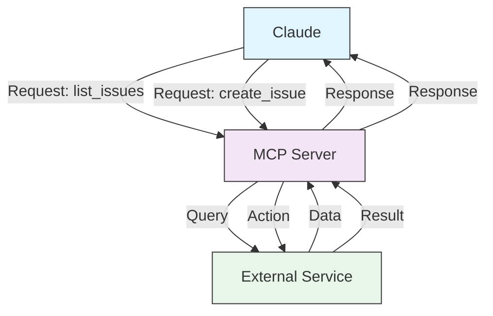
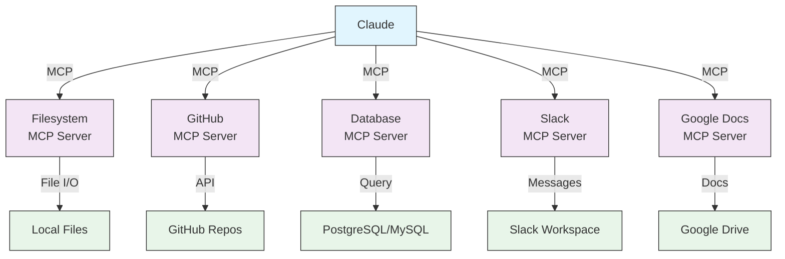
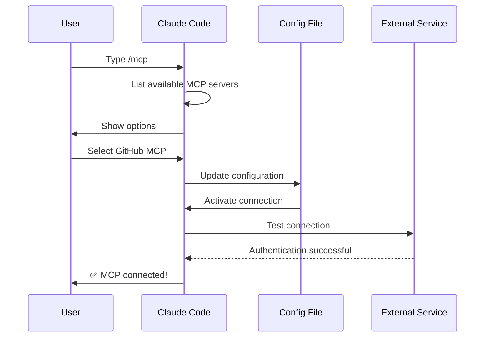
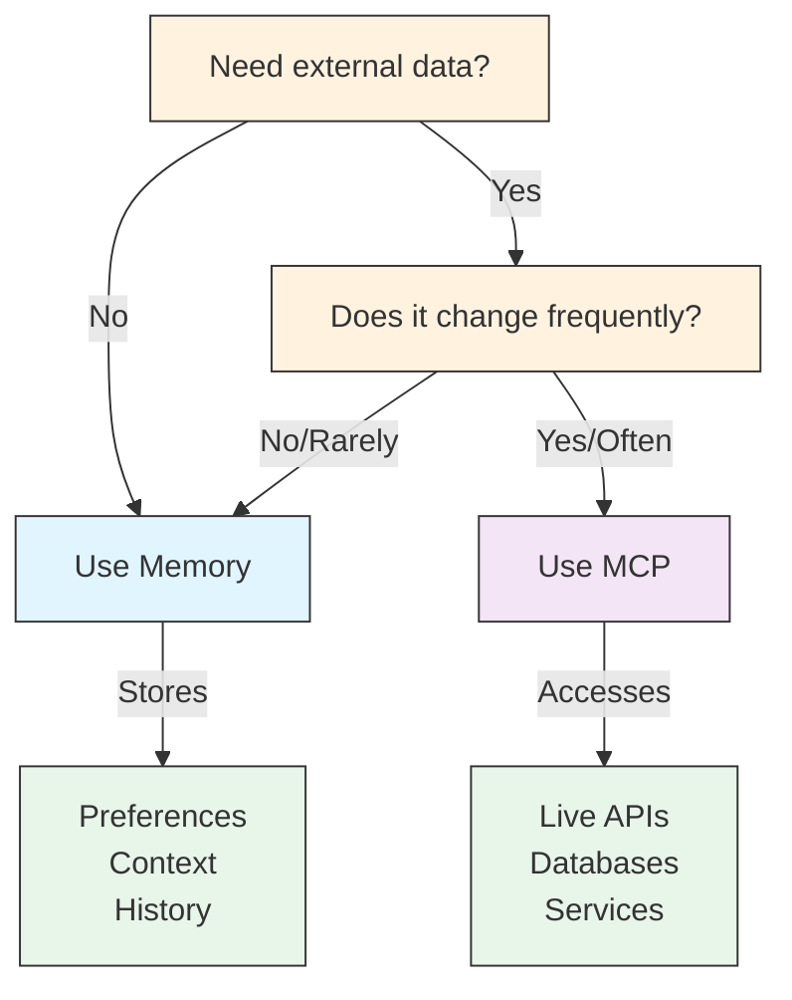
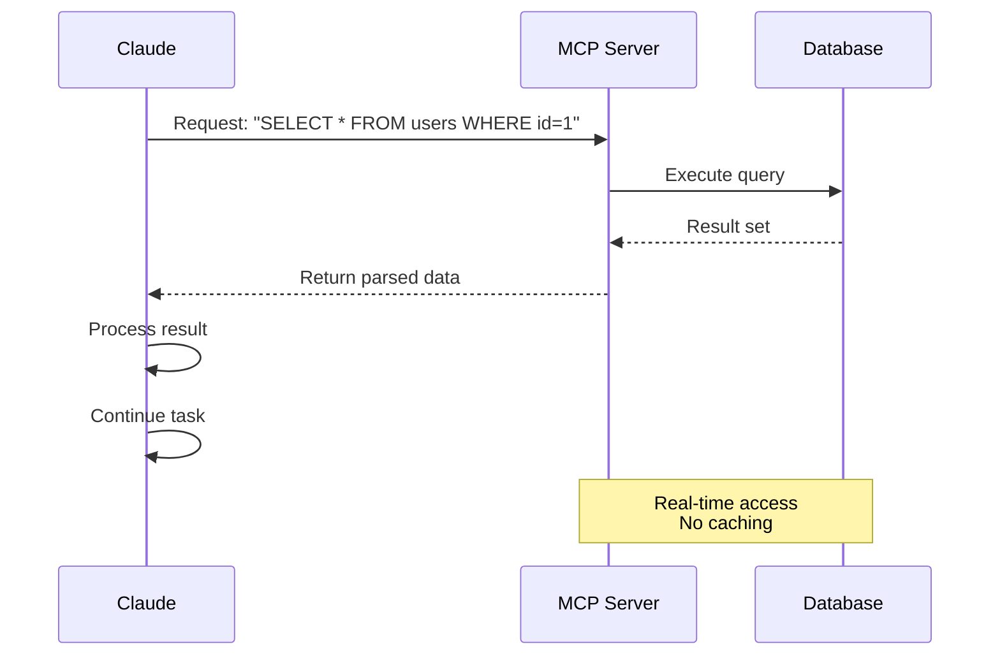
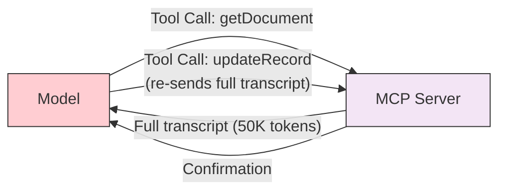
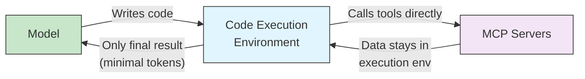

# MCP (Model Context Protocol)

This folder contains comprehensive documentation and examples for MCP server configurations and usage with Claude Code.

## Overview

MCP (Model Context Protocol) is a standardized way for Claude to access external tools, APIs, and real-time data sources. Unlike Memory, MCP provides live access to changing data.

Key characteristics:
- Real-time access to external services
- Live data synchronization
- Extensible architecture
- Secure authentication
- Tool-based interactions

<br/>
<br/>

---

## MCP Architecture



<br/>
<br/>

---

## MCP Ecosystem



<br/>
<br/>

---

## MCP Installation Methods

Claude Code supports multiple transport protocols for MCP server connections:

### HTTP Transport (Recommended)

```bash
# Basic HTTP connection
claude mcp add --transport http notion https://mcp.notion.com/mcp

# HTTP with authentication header
claude mcp add --transport http secure-api https://api.example.com/mcp \
  --header "Authorization: Bearer your-token"

claude mcp add -s user --transport http github https://api.githubcopilot.com/mcp \
  -H "Authorization: Bearer YOUR_GITHUB_PAT"
```

### Stdio Transport (Local)

For locally running MCP servers:

```bash
# Local Node.js server
claude mcp add --transport stdio myserver -- npx @myorg/mcp-server

# With environment variables
claude mcp add --transport stdio myserver --env KEY=value -- npx server

# Github server (local node.js server(stdio) that connect to remote http server)
claude mcp add github GITHUB_PERSONAL_ACCESS_TOKEN=$GITHUB_PAT -- npx -y @modelcontextprotocol/server-github
```

- [Other Installation Details](./mcp-installation-details.md)


<br/>
<br/>

---
## MCP Setup Process



### `/mcp` command

Type `/mcp` inside a session to list connected servers, trigger OAuth flows, and inspect connection state.

- Since **v2.1.121**, MCP retries the initial connection up to 3 times on transient errors.
- Since **v2.1.128**, `/mcp` displays the **tool count** for each connected server and visually flags servers reporting **0 tools** so misconfigured servers stand out at a glance.


<br/>
<br/>

---

## MCP Tool Search

When MCP tool descriptions exceed 10% of the context window, Claude Code automatically enables tool search to efficiently select the right tools without overwhelming the model context.

| Setting | Value | Description |
|---------|-------|-------------|
| `ENABLE_TOOL_SEARCH` | `auto` (default) | Automatically enables when tool descriptions exceed 10% of context |
| `ENABLE_TOOL_SEARCH` | `auto:<N>` | Automatically enables at a custom threshold of `N` tools |
| `ENABLE_TOOL_SEARCH` | `true` | Always enabled regardless of tool count |
| `ENABLE_TOOL_SEARCH` | `false` | Disabled; all tool descriptions sent in full |

> **Note:** Tool search requires Sonnet 4 or later, or Opus 4 or later. Haiku models are not supported for tool search.

### Bypassing Tool Search per Server (v2.1.121+)

If a particular MCP server's tools are needed on every turn, mark its
configuration with `"alwaysLoad": true` to skip tool-search deferral and
keep its tools always available:

```json
{
  "mcpServers": {
    "always-on-tool": {
      "command": "node",
      "args": ["./tools/always.js"],
      "alwaysLoad": true
    }
  }
}
```

Use sparingly — every always-loaded tool consumes context that could
otherwise be used for tool search to surface a more relevant tool.


<br/>
<br/>

---

## MCP Prompts as Slash Commands

MCP servers can expose prompts that appear as slash commands in Claude Code. Prompts are accessible using the naming convention:

```
/mcp__<server>__<prompt>
```

For example, if a server named `github` exposes a prompt called `review`, you can invoke it as `/mcp__github__review`.


<br/>
<br/>

---

## MCP Resources via @ Mentions

You can reference MCP resources directly in your prompts using the `@` mention syntax:

```
@server-name:protocol://resource/path
```

For example, to reference a specific database resource:

```
@database:postgres://mydb/users
```

This allows Claude to fetch and include MCP resource content inline as part of the conversation context.


<br/>
<br/>

---

## MCP Scopes

MCP configurations can be stored at different scopes with varying levels of sharing:

| Scope | Flag | Location | Description | Shared With | Requires Approval |
|-------|------|----------|-------------|-------------|------------------|
| **Local** (default) | `--scope local` | `~/.claude.json` (under project path) | Private to current user, current project only (was called `project` in older versions) | Just you | No |
| **Project** | `--scope project` | `.mcp.json` | Checked into git repository | Team members | Yes (first use) |
| **User** | `--scope user` | `~/.claude.json` | Available across all projects (was called `global` in older versions) | Just you | No |

Select a scope when adding a server with `--scope` (short form `-s`). Omit it and
Claude Code uses `local`:

```bash
# Project scope — writes to .mcp.json so the team shares it
claude mcp add --scope project --transport http github https://api.github.com/mcp

# User scope — available in every project
claude mcp add --scope user --transport stdio memory -- npx @modelcontextprotocol/server-memory
```

### Using Project Scope

Store project-specific MCP configurations in `.mcp.json`:

```json
{
  "mcpServers": {
    "github": {
      "type": "http",
      "url": "https://api.github.com/mcp"
    }
  }
}
```

Team members will see an approval prompt on first use of project MCPs. In an untrusted workspace, servers that a repo self-approved via a committed `.claude/settings.json` are **not** auto-spawned by `claude mcp list`/`get` — they show `⏸ Pending approval` until you accept the trust dialog, and `enableAllProjectMcpServers` is ignored in an untrusted folder (v2.1.196).

<br/>
<br/>

---

## MCP Configuration Management

### Adding MCP Servers

```bash
# Add HTTP-based server
claude mcp add --transport http github https://api.github.com/mcp

# Add local stdio server
claude mcp add --transport stdio database -- npx @company/db-server

# List all MCP servers
claude mcp list

# Get details on specific server
claude mcp get github

# Remove an MCP server
claude mcp remove github

# Reset project-specific approval choices
claude mcp reset-project-choices

# Authenticate an MCP server from the CLI (v2.1.186+)
claude mcp login github

# Sign out of an MCP server (v2.1.186+)
claude mcp logout github

# Import from Claude Desktop
claude mcp add-from-claude-desktop

# Add a server from a JSON blob (useful for scripted setup)
claude mcp add-json events-server '{"type":"stdio","command":"npx","args":["@modelcontextprotocol/server-events"]}'
```

> **Note**: In JSON configs — `.mcp.json`, `~/.claude.json`, or `claude mcp add-json` — the `type` field accepts `streamable-http` as an alias for `http`. The MCP specification uses the name `streamable-http` for this transport, so configurations copied from a server's own documentation work unmodified.

Since v2.1.238, `claude mcp list` and `claude mcp get` show disabled servers as `⊘ Disabled` without connecting to them for a health check.

`claude mcp login <name>` / `claude mcp logout <name>` are the non-interactive equivalent of the OAuth flow in the `/mcp` menu — authenticate or sign out without opening it. Add `--no-browser` to `login` to complete OAuth over SSH or in a headless session (it redirects the flow through stdin).

<br/>
<br/>

---
## Available MCP Servers Table

| MCP Server | Purpose | Common Tools | Auth | Real-time |
|------------|---------|--------------|------|-----------|
| **Filesystem** | File operations | read, write, delete | OS permissions | ✅ Yes |
| **GitHub** | Repository management | list_prs, create_issue, push | OAuth | ✅ Yes |
| **Slack** | Team communication | send_message, list_channels | Token | ✅ Yes |
| **Database** | SQL queries | query, insert, update | Credentials | ✅ Yes |
| **Google Docs** | Document access | read, write, share | OAuth | ✅ Yes |
| **Asana** | Project management | create_task, update_status | API Key | ✅ Yes |
| **Stripe** | Payment data | list_charges, create_invoice | API Key | ✅ Yes |
| **Memory** | Persistent memory | store, retrieve, delete | Local | ❌ No |


<br/>
<br/>

---

## [Practical Examples](./practical-examples.md)


<br/>
<br/>

---

## MCP vs Memory: Decision Matrix



<br/>
<br/>

---

## Request/Response Pattern




<br/>
<br/>

---

## Solving Context Bloat with Code Execution

As MCP adoption scales, connecting to dozens of servers with hundreds or thousands of tools creates a significant challenge: **context bloat**. This is arguably the biggest problem with MCP at scale, and Anthropic's engineering team has proposed an elegant solution — using code execution instead of direct tool calls.

> **Source**: [Code Execution with MCP: Building More Efficient Agents](https://www.anthropic.com/engineering/code-execution-with-mcp) — Anthropic Engineering Blog

### The Problem: Two Sources of Token Waste

**1. Tool definitions overload the context window**

Most MCP clients load all tool definitions upfront. When connected to thousands of tools, the model must process hundreds of thousands of tokens before it even reads the user's request.

**2. Intermediate results consume additional tokens**

Every intermediate tool result passes through the model's context. Consider transferring a meeting transcript from Google Drive to Salesforce — the full transcript flows through context **twice**: once when reading it, and again when writing it to the destination. A 2-hour meeting transcript could mean 50,000+ extra tokens.



### The Solution: MCP Tools as Code APIs

Instead of passing tool definitions and results through the context window, the agent **writes code** that calls MCP tools as APIs. The code runs in a sandboxed execution environment, and only the final result returns to the model.



#### How It Works

MCP tools are presented as a file tree of typed functions:

```
servers/
├── google-drive/
│   ├── getDocument.ts
│   └── index.ts
├── salesforce/
│   ├── updateRecord.ts
│   └── index.ts
└── ...
```

Each tool file contains a typed wrapper:

```typescript
// ./servers/google-drive/getDocument.ts
import { callMCPTool } from "../../../client.js";

interface GetDocumentInput {
  documentId: string;
}

interface GetDocumentResponse {
  content: string;
}

export async function getDocument(
  input: GetDocumentInput
): Promise<GetDocumentResponse> {
  return callMCPTool<GetDocumentResponse>(
    'google_drive__get_document', input
  );
}
```

The agent then writes code to orchestrate the tools:

```typescript
import * as gdrive from './servers/google-drive';
import * as salesforce from './servers/salesforce';

// Data flows directly between tools — never through the model
const transcript = (
  await gdrive.getDocument({ documentId: 'abc123' })
).content;

await salesforce.updateRecord({
  objectType: 'SalesMeeting',
  recordId: '00Q5f000001abcXYZ',
  data: { Notes: transcript }
});
```

**Result: Token usage drops from ~150,000 to ~2,000 — a 98.7% reduction.**

### Key Benefits

| Benefit | Description |
|---------|-------------|
| **Progressive Disclosure** | Agent browses the filesystem to load only the tool definitions it needs, instead of all tools upfront |
| **Context-Efficient Results** | Data is filtered/transformed in the execution environment before returning to the model |
| **Powerful Control Flow** | Loops, conditionals, and error handling run in code without round-tripping through the model |
| **Privacy Preservation** | Intermediate data (PII, sensitive records) stays in the execution environment; never enters the model context |
| **State Persistence** | Agents can save intermediate results to files and build reusable skill functions |

#### Example: Filtering Large Datasets

```typescript
// Without code execution — all 10,000 rows flow through context
// TOOL CALL: gdrive.getSheet(sheetId: 'abc123')
//   -> returns 10,000 rows in context

// With code execution — filter in the execution environment
const allRows = await gdrive.getSheet({ sheetId: 'abc123' });
const pendingOrders = allRows.filter(
  row => row["Status"] === 'pending'
);
console.log(`Found ${pendingOrders.length} pending orders`);
console.log(pendingOrders.slice(0, 5)); // Only 5 rows reach the model
```

#### Example: Loop Without Round-Tripping

```typescript
// Poll for a deployment notification — runs entirely in code
let found = false;
while (!found) {
  const messages = await slack.getChannelHistory({
    channel: 'C123456'
  });
  found = messages.some(
    m => m.text.includes('deployment complete')
  );
  if (!found) await new Promise(r => setTimeout(r, 5000));
}
console.log('Deployment notification received');
```

### Trade-offs to Consider

Code execution introduces its own complexity. Running agent-generated code requires:

- A **secure sandboxed execution environment** with appropriate resource limits
- **Monitoring and logging** of executed code
- Additional **infrastructure overhead** compared to direct tool calls

The benefits — reduced token costs, lower latency, improved tool composition — should be weighed against these implementation costs. For agents with only a few MCP servers, direct tool calls may be simpler. For agents at scale (dozens of servers, hundreds of tools), code execution is a significant improvement.

- [MCPorter](./mcporter.md)


<br/>
<br/>

---
## Best Practices

### Security Considerations

#### Do's ✅
- Use environment variables for all credentials
- Rotate tokens and API keys regularly (monthly recommended)
- Use read-only tokens when possible
- Limit MCP server access scope to minimum required
- Monitor MCP server usage and access logs
- Use OAuth for external services when available
- Implement rate limiting on MCP requests
- Test MCP connections before production use
- Document all active MCP connections
- Keep MCP server packages updated

#### Don'ts ❌
- Don't hardcode credentials in config files
- Don't commit tokens or secrets to git
- Don't share tokens in team chats or emails
- Don't use personal tokens for team projects
- Don't grant unnecessary permissions
- Don't ignore authentication errors
- Don't expose MCP endpoints publicly
- Don't run MCP servers with root/admin privileges
- Don't cache sensitive data in logs
- Don't disable authentication mechanisms

### Configuration Best Practices

1. **Version Control**: Keep `.mcp.json` in git but use environment variables for secrets
2. **Least Privilege**: Grant minimum permissions needed for each MCP server
3. **Isolation**: Run different MCP servers in separate processes when possible
4. **Monitoring**: Log all MCP requests and errors for audit trails
5. **Testing**: Test all MCP configurations before deploying to production

### Performance Tips

- Cache frequently accessed data at the application level
- Use MCP queries that are specific to reduce data transfer
- Monitor response times for MCP operations
- Consider rate limiting for external APIs
- Use batching when performing multiple operations


- [Installation Instructions](installation-instructions.md)
- [Troubleshooting](./troubleshooting.md)


<br/>
<br/>

---

## Related Concepts

### Memory vs MCP
- **Memory**: Stores persistent, unchanging data (preferences, context, history)
- **MCP**: Accesses live, changing data (APIs, databases, real-time services)

### When to Use Each
- **Use Memory** for: User preferences, conversation history, learned context
- **Use MCP** for: Current GitHub issues, live database queries, real-time data

### Integration with Other Claude Features
- Combine MCP with Memory for rich context
- Use MCP tools in prompts for better reasoning
- Leverage multiple MCPs for complex workflows


<br/>
<br/>

---

## Additional Resources

- [Official MCP Documentation](https://code.claude.com/docs/en/mcp)
- [MCP Protocol Specification](https://modelcontextprotocol.io/specification)
- [MCP GitHub Repository](https://github.com/modelcontextprotocol/servers)
- [Available MCP Servers](https://github.com/modelcontextprotocol/servers)
- [MCPorter](https://github.com/steipete/mcporter) — TypeScript runtime & CLI for calling MCP servers without boilerplate
- [Code Execution with MCP](https://www.anthropic.com/engineering/code-execution-with-mcp) — Anthropic's engineering blog on solving context bloat
- [Claude Code CLI Reference](https://code.claude.com/docs/en/cli-reference)
- [Claude API Documentation](https://docs.anthropic.com)

---

**Last Updated**: August 25, 2026
**Claude Code Version**: 2.1.245
**Sources**:
- https://code.claude.com/docs/en/mcp
- https://code.claude.com/docs/en/changelog
- https://github.com/anthropics/claude-code/releases/tag/v2.1.117
- https://github.com/anthropics/claude-code/releases/tag/v2.1.139
- https://github.com/anthropics/claude-code/blob/main/CHANGELOG.md
- https://code.claude.com/docs/en/model-config
**Compatible Models**: Claude Fable 5, Claude Opus 5, Claude Sonnet 5, Claude Sonnet 4.6, Claude Opus 4.8, Claude Haiku 4.5
