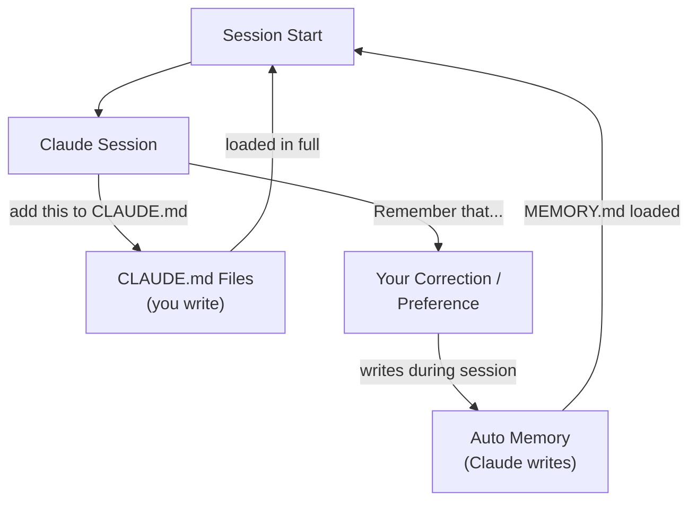

## Memory Architecture

Memory in Claude Code follows a hierarchical system where different scopes serve different purposes. Unlike Claude Web/Desktop's 24-hour synthesis cycle Claude Code has two memory systems that both load at the start of every session and update continuously, not on a timer:

