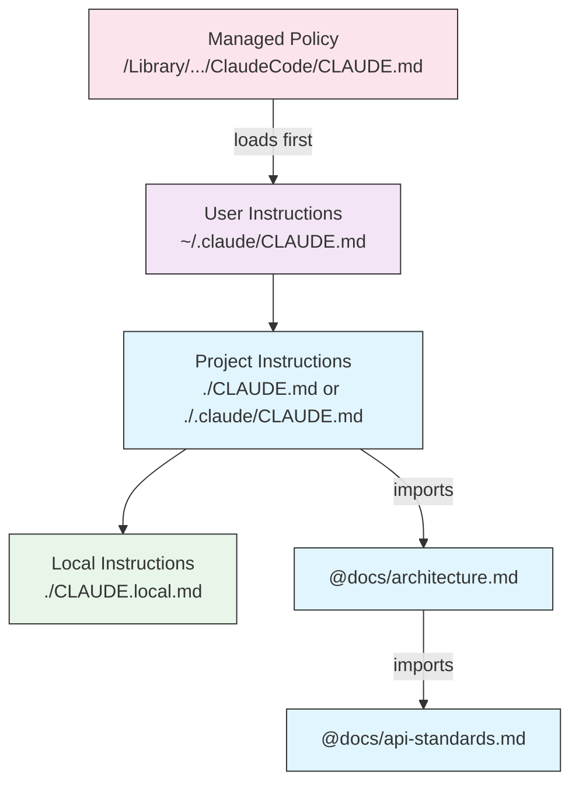
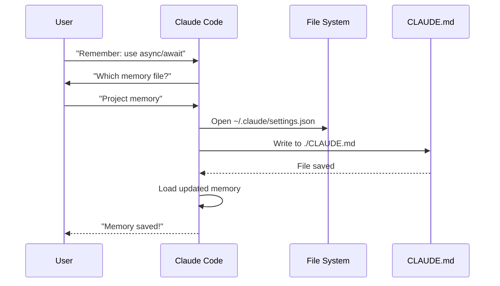
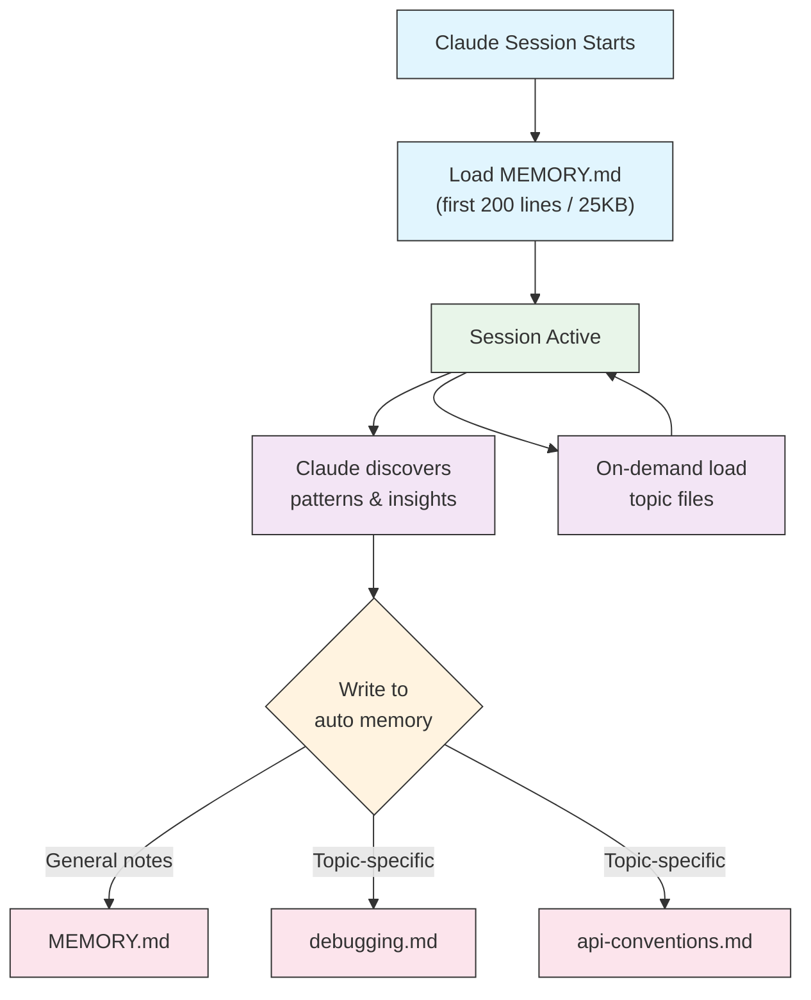

# Memory Guide

Memory enables Claude to retain context across sessions and conversations. It exists in two forms: automatic synthesis in claude.ai, and filesystem-based CLAUDE.md in Claude Code.

## Overview

Memory in Claude Code provides persistent context that carries across multiple sessions and conversations. Unlike temporary context windows, memory files allow you to:

- Share project standards across your team
- Store personal development preferences
- Maintain directory-specific rules and configurations
- Import external documentation
- Version control memory as part of your project

The memory system operates at multiple levels, from global personal preferences down to specific subdirectories, allowing for fine-grained control over what Claude remembers and how it applies that knowledge.

<br/>
<br/>

---
## Memory Commands Quick Reference

| Command | Purpose | Usage | When to Use |
|---------|---------|-------|-------------|
| `/init` | Initialize project memory | `/init` | Starting new project, first-time CLAUDE.md setup |
| `/memory` | Edit memory files in editor | `/memory` | Extensive updates, reorganization, reviewing content |
| `#` prefix | ~~Quick single-line memory add~~ **Discontinued** | — | Use `/memory` or ask conversationally instead |
| `@path/to/file` | Import external content | `@README.md` or `@docs/api.md` | Referencing existing documentation in CLAUDE.md |

## Quick Start: Initializing Memory

### The `/init` Command

The `/init` command is the fastest way to set up project memory in Claude Code. It initializes a CLAUDE.md file with foundational project documentation.

**Usage:**

```bash
/init
```

**What it does:**

- Creates a new CLAUDE.md file in your project (typically at `./CLAUDE.md` or `./.claude/CLAUDE.md`)
- Establishes project conventions and guidelines
- Sets up the foundation for context persistence across sessions
- Provides a template structure for documenting your project standards


**When to use `/init`:**

- Starting a new project with Claude Code
- Establishing team coding standards and conventions
- Creating documentation about your codebase structure
- Setting up memory hierarchy for collaborative development

**Example workflow:**

```markdown
# In your project directory
/init

# Claude creates CLAUDE.md with structure like:
# Project Configuration
## Project Overview
- Name: Your Project
- Tech Stack: [Your technologies]
- Team Size: [Number of developers]

## Development Standards
- Code style preferences
- Testing requirements
- Git workflow conventions
```


**Option 2: Ask conversationally**

```
Remember that we always use TypeScript strict mode in this project.
Please add to memory: prefer async/await over promise chains.
```

Claude will update the appropriate CLAUDE.md file based on your request.

<br/>
<br/>

---
## Using Memory Imports

CLAUDE.md files support the `@path/to/file` syntax to include external content:

```markdown
# Project Documentation
See @README.md for project overview
See @package.json for available npm commands
See @docs/architecture.md for system design

# Import from home directory using absolute path
@~/.claude/my-project-instructions.md
```

**Import features:**

- Both relative and absolute paths are supported (e.g., `@docs/api.md` or `@~/.claude/my-project-instructions.md`)
- Recursive imports are supported with a maximum depth of 4 hops
- First-time imports from external locations trigger an approval dialog for security
- Import directives are not evaluated inside markdown code spans or code blocks (so documenting them in examples is safe)
- Helps avoid duplication by referencing existing documentation
- Automatically includes referenced content in Claude's context

<br/>
<br/>

---
## Memory Hierarchy in Claude Code

Claude Code has two complementary memory systems, both loaded at the start of every conversation:
- **CLAUDE.md files** (instructions you write) and 
- **auto memory** (notes Claude writes itself). 

CLAUDE.md files are **concatenated into context rather than overriding each other** — this is not a strict precedence chain where a higher tier replaces a lower one. 

**CLAUDE.md file locations, in load order (broadest scope to most specific):**

| Scope | Location | Purpose |
|-------|----------|---------|
| Managed policy | macOS: `/Library/Application Support/ClaudeCode/CLAUDE.md`<br>Linux/WSL: `/etc/claude-code/CLAUDE.md`<br>Windows: `C:\Program Files\ClaudeCode\CLAUDE.md` | Organization-wide instructions managed by IT/DevOps. Cannot be excluded by individual settings. |
| User instructions | `~/.claude/CLAUDE.md` | Personal preferences for all projects |
| Project instructions | `./CLAUDE.md` or `./.claude/CLAUDE.md` | Team-shared instructions, version controlled |
| Local instructions | `./CLAUDE.local.md` | Personal project-specific preferences; add to `.gitignore` |


**Memory Discovery Behavior:**



All files shown are concatenated into one context, not selected by override — later boxes appear later in context, not "instead of" earlier ones.


<br/>
<br/>

---

## Memory Locations Table

CLAUDE.md files and rules are concatenated into context, not selected by strict override — "Load order" below means *where in context it appears*, not *which one wins*. Auto memory is a separate mechanism with its own storage location.

| Location | Type | Load order | Shared | Access | Best For |
|----------|------|-------------|--------|--------|----------|
| `/Library/Application Support/ClaudeCode/CLAUDE.md` (macOS) | Managed Policy | 1st (loads first) | Organization | System | Company-wide policies |
| `/etc/claude-code/CLAUDE.md` (Linux/WSL) | Managed Policy | 1st (loads first) | Organization | System | Organization standards |
| `C:\Program Files\ClaudeCode\CLAUDE.md` (Windows) | Managed Policy | 1st (loads first) | Organization | System | Corporate guidelines |
| `~/.claude/rules/*.md` | User Rules | 2nd | Individual | Filesystem | Personal rules (all projects) |
| `~/.claude/CLAUDE.md` | User Memory | 3rd | Individual | Filesystem | Personal preferences (all projects) |
| `./.claude/rules/*.md` | Project Rules | 4th | Team | Git | Path-specific, modular rules |
| `./CLAUDE.md` or `./.claude/CLAUDE.md` | Project Memory | 5th | Team | Git | Team standards, shared architecture |
| `./CLAUDE.local.md` | Project Local | 6th (loads last) | Individual | Git (ignored) | Personal project-specific preferences |
| `~/.claude/projects/<project>/memory/` | Auto Memory | N/A — separate mechanism | Individual | Filesystem | Claude's automatic notes and learnings |


<br/>
<br/>

---

## Memory Update Lifecycle

Here's how memory updates flow through your Claude Code sessions:



<br/>
<br/>

---
## Auto Memory

Auto memory is a persistent directory where Claude automatically records learnings, patterns, and insights as it works with your project. Unlike CLAUDE.md files which you write and maintain manually, auto memory is written by Claude itself during sessions.

### How Auto Memory Works

- **Location**: `~/.claude/projects/<project>/memory/`
- **Entrypoint**: `MEMORY.md` serves as the main file in the auto memory directory
- **Topic files**: Optional additional files for specific subjects (e.g., `debugging.md`, `api-conventions.md`)
- **Loading behavior**: The first 200 lines of `MEMORY.md` (or first 25KB, whichever comes first) are loaded into context at session start. Topic files are loaded on demand, not at startup.
- **Read/write**: Claude reads and writes memory files during sessions as it discovers patterns and project-specific knowledge
- **Frontmatter**: Files that begin with YAML frontmatter get a `modified` field — an ISO 8601 timestamp Claude Code records each time it writes the file (v2.1.214)

### Auto Memory Architecture



### Auto Memory Directory Structure

```
~/.claude/projects/<project>/memory/
├── MEMORY.md              # Entrypoint (first 200 lines / 25KB loaded at startup)
├── debugging.md           # Topic file (loaded on demand)
├── api-conventions.md     # Topic file (loaded on demand)
└── testing-patterns.md    # Topic file (loaded on demand)
```


[Additional directories with --add-dir](./add-dir.md)


<br/>
<br/>

---
## [Practical Examples](./practical-examples.md)


<br/>
<br/>


---
## Best Practices

### Do's - What To Include

- **Be specific and detailed**: Use clear, detailed instructions rather than vague guidance
  - ✅ Good: "Use 2-space indentation for all JavaScript files"
  - ❌ Avoid: "Follow best practices"

- **Keep organized**: Structure memory files with clear markdown sections and headings

- **Use appropriate hierarchy levels**:
  - **Managed policy**: Company-wide policies, security standards, compliance requirements
  - **Project memory**: Team standards, architecture, coding conventions (commit to git)
  - **User memory**: Personal preferences, communication style, tooling choices
  - **Directory memory**: Module-specific rules and overrides

- **Leverage imports**: Use `@path/to/file` syntax to reference existing documentation
  - Supports a maximum depth of 4 hops for recursive imports
  - Avoids duplication across memory files
  - Example: `See @README.md for project overview`

- **Document frequent commands**: Include commands you use repeatedly to save time

- **Version control project memory**: Commit project-level CLAUDE.md files to git for team benefit

- **Review periodically**: Update memory regularly as projects evolve and requirements change

- **Provide concrete examples**: Include code snippets and specific scenarios

### Don'ts - What To Avoid

- **Don't store secrets**: Never include API keys, passwords, tokens, or credentials

- **Don't include sensitive data**: No PII, private information, or proprietary secrets

- **Don't duplicate content**: Use imports (`@path`) to reference existing documentation instead

- **Don't be vague**: Avoid generic statements like "follow best practices" or "write good code"

- **Don't make it too long**: Target **under 200 lines** per CLAUDE.md. Longer files still load in full, but adherence drops — see [Keeping CLAUDE.md small](#keeping-claudemd-small) below

- **Don't over-organize**: Use hierarchy strategically; don't create excessive subdirectory overrides

- **Don't forget to update**: Stale memory can cause confusion and outdated practices

- **Don't exceed nesting limits**: Memory imports support a maximum depth of 4 hops

### Keeping CLAUDE.md Small

Anthropic's current guidance is the opposite of "put everything in CLAUDE.md". The file loads into **every** session, so every line you add is a line that competes for attention on tasks it has nothing to do with.

**Rule of thumb: keep CLAUDE.md under 200 lines.** Longer files still load in full, but instruction adherence degrades as the file grows.

When it starts growing, move content out rather than trimming prose:

| Content | Where it belongs | Why |
|---------|------------------|-----|
| Multi-step procedures | A [skill](../skills/) | Loads on demand, only when relevant |
| Directory- or file-type-specific rules | `.claude/rules/*.md` with `paths:` frontmatter | Scoped by glob; loads only when you touch matching files |
| Reference material and long examples | A skill's `references/` directory | Read only when the skill needs it |
| Things Claude should remember about *you* | Auto memory (on by default) | Written and loaded automatically |

> **Note**: `@path` imports organize a large CLAUDE.md but do **not** save context — imported files are pulled in at load time just the same. Splitting into path-scoped rules is what actually reduces what loads.

`/doctor` (v2.1.206+) inspects your configuration and proposes trims when CLAUDE.md has grown past the point of usefulness.

### Don't Write Verification Reminders

Older guidance encouraged lines like "always run the tests before saying you're done" or "double-check your work". On **Claude Opus 5 and Fable 5 these now cause over-verification** — Claude re-checks work that was already correct, burning turns and tokens.

Anthropic removed more than 80% of Claude Code's own system prompt for the Claude 5 generation with no measured regression. The same principle applies to your CLAUDE.md: prefer stating the goal and letting Claude exercise judgment over enumerating the checks it should perform.

Delete verification reminders from existing CLAUDE.md files targeting Opus 5 or Fable 5. Keep genuinely non-obvious project requirements — "integration tests need Docker running" is information, not a reminder.

### Memory Management Tips

**Choose the right memory level:**

| Use Case | Memory Level | Rationale |
|----------|-------------|-----------|
| Company security policy | Managed Policy | Applies to all projects organization-wide |
| Team code style guide | Project | Shared with team via git |
| Your preferred editor shortcuts | User | Personal preference, not shared |
| API module standards | Directory | Specific to that module only |

**Quick update workflow:**

1. For single rules: Use `/memory` to open editor, or ask conversationally
2. For multiple changes: Use `/memory` to open editor
3. For initial setup: Use `/init` to create template

**Import best practices:**

```markdown
# Good: Reference existing docs
@README.md
@docs/architecture.md
@package.json

# Avoid: Copying content that exists elsewhere
# Instead of copying README content into CLAUDE.md, just import it
```


## Official Documentation

For the most up-to-date information, refer to the official Claude Code documentation:

- **[Memory Documentation](https://code.claude.com/docs/en/memory)** - Complete memory system reference
- **[Slash Commands Reference](https://code.claude.com/docs/en/interactive-mode)** - All built-in commands including `/init` and `/memory`
- **[CLI Reference](https://code.claude.com/docs/en/cli-reference)** - Command-line interface documentation

### Key Technical Details from Official Docs

**Memory Loading:**

- All memory files are automatically loaded when Claude Code launches
- Claude traverses upward from the current working directory to discover CLAUDE.md files
- Subtree files are discovered and loaded contextually when accessing those directories

**Import Syntax:**

- Use `@path/to/file` to include external content (e.g., `@~/.claude/my-project-instructions.md`)
- Supports both relative and absolute paths (relative paths resolve relative to the file containing the import, not the working directory)
- Recursive imports supported with a maximum depth of 4 hops
- First-time external imports trigger an approval dialog
- Not evaluated inside markdown code spans or code blocks
- Automatically includes referenced content in Claude's context

**CLAUDE.md Load Order** (concatenated into context, not strict override — see [Memory Hierarchy in Claude Code](#memory-hierarchy-in-claude-code) above):

1. Managed Policy (loads first)
2. User-Level Rules (`~/.claude/rules/`)
3. User Memory
4. Project Rules (`.claude/rules/`)
5. Project Memory
6. Local Project Memory (loads last)

Auto Memory is a separate mechanism (`~/.claude/projects/<project>/memory/`), not part of this concatenation order.

---

**Last Updated**: August 25, 2026
**Claude Code Version**: 2.1.245
**Sources**:
- https://code.claude.com/docs/en/memory
**Compatible Models**: Claude Fable 5, Claude Opus 5, Claude Sonnet 5, Claude Sonnet 4.6, Claude Opus 4.8, Claude Haiku 4.5
