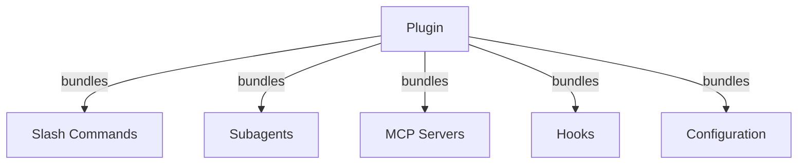
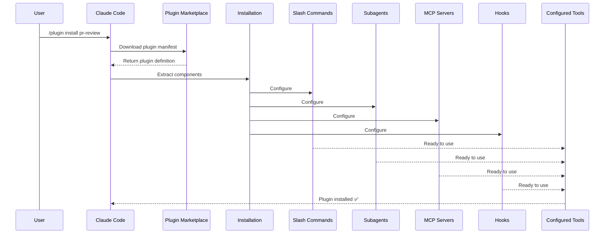
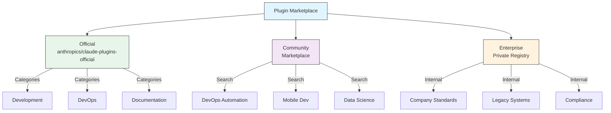
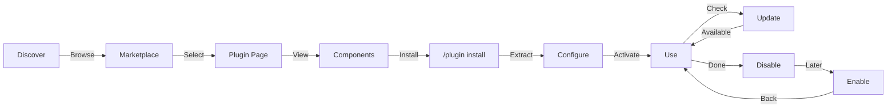
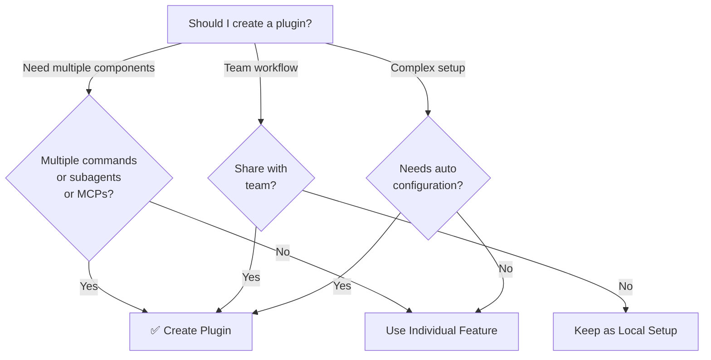

# Claude Code Plugins

This folder contains complete plugin examples that bundle multiple Claude Code features into cohesive, installable packages.

## Overview

Claude Code Plugins are bundled collections of customizations (slash commands, subagents, MCP servers, and hooks) that install with a single command. They represent the highest-level extension mechanism—combining multiple features into cohesive, shareable packages.


<br/>
<br/>

---
### Definitions

Here are quick, simple definitions for the key terms used in the Claude plugin ecosystem:

**Plugin**
>A software add-on or extension that gives Claude new capabilities, such as running a real web browser, checking code types, or connecting to external apps like Slack.

**Marketplace**
>A central registry or directory (like a GitHub repository) that lists available plugins so users can easily find and install them.

**Manifest File**
>A configuration file (usually named marketplace.json or plugin.json) that acts as an ID card, telling Claude exactly what a plugin is named, what it does, and how to run it.

**Scope**
>The boundary where a plugin is active; a plugin can be installed globally (available across your entire computer) or locally (restricted only to a specific project folder).

**Command Namespace**
>A prefix (like user: or project:) added to the front of a slash command to prevent different plugins from accidentally using the same command name.


<br/>
<br/>

---
## Plugin Architecture



<br/>
<br/>

---
## Plugin Loading Process




<br/>
<br/>

---
## Plugin Types & Distribution

| Type | Scope | Shared | Authority | Examples |
|------|-------|--------|-----------|----------|
| Official | Global | All users | Anthropic | PR Review, Security Guidance |
| Community | Public | All users | Community | DevOps, Data Science |
| Organization | Internal | Team members | Company | Internal standards, tools |
| Personal | Individual | Single user | Developer | Custom workflows |


<br/>
<br/>

---
## [Plugin Structure, Creation](./plugin-creation.md)

<br/>
<br/>

---
## Plugin Marketplace

The official Anthropic-managed plugin directory is `anthropics/claude-plugins-official`, auto-registered on first interactive launch. Enterprise admins can also create private plugin marketplaces for internal distribution.

There is also a **community marketplace**, `anthropics/claude-plugins-community`, hosting third-party plugins that have passed Anthropic's automated validation and safety screening — each pinned to a specific commit SHA in the catalog. Unlike the official marketplace you add it manually:

```bash
/plugin marketplace add anthropics/claude-plugins-community

# Then install from it using the claude-community marketplace name
/plugin install <plugin-name>@claude-community
```



### Marketplace Configuration

Enterprise and advanced users can control marketplace behavior through settings:

| Setting | Description |
|---------|-------------|
| `extraKnownMarketplaces` | Add additional marketplace sources beyond the defaults |
| `strictKnownMarketplaces` | Control which marketplaces users are allowed to add (managed-only) |
| `blockedMarketplaces` | Admin-managed blocklist of marketplaces (supports `hostPattern` / `pathPattern` regex fields since v2.1.119) |
| `deniedPlugins` | Admin-managed blocklist to prevent specific plugins from being installed |

> **Friendlier aliases (v2.1.232)**: `additionalMarketplaces` is accepted as an alias for
> `extraKnownMarketplaces`, and `allowedMarketplaces` for `strictKnownMarketplaces`.
> **Changelog-sourced** — the v2.1.232 changelog announces them, but the official settings
> reference does not yet list either name. The canonical keys are safe to keep using.

> **Owner wildcards (v2.1.223+)**: a `"owner/*"` entry allows or blocks every marketplace
> repo under one GitHub owner. **Accepted only in `strictKnownMarketplaces` and
> `blockedMarketplaces`.** Everywhere else a `github` source appears — including
> `extraKnownMarketplaces` and `/plugin marketplace add` — the `repo` value must name a
> single repository.

> **Enforcement** (v2.1.117+): `blockedMarketplaces` and `strictKnownMarketplaces` are enforced on every plugin lifecycle event — install, update, refresh, and autoupdate — not just at first add. `strictKnownMarketplaces` is managed-only.

Example `blockedMarketplaces` with host/path regex (v2.1.119):

```json
{
  "blockedMarketplaces": [
    {
      "hostPattern": "^evil\\.example\\.com$",
      "pathPattern": "^/marketplaces/.*"
    }
  ]
}
```

#### Marketplace `headersHelper` (v2.1.238)

A `url` marketplace — or an individual catalog entry — can name a `headersHelper` command that mints the HTTP headers used to fetch the catalog and any same-origin archives. This is how a private marketplace behind a token-issuing service authenticates without a static secret in the config.

A **catalog entry's** helper runs only on install or update, and only after its command has been shown to you: `claude plugin install` and `claude plugin update` prompt `[y/N]` before running it. Pass `-y` to accept without the prompt in automation.

### Additional Marketplace Features

- **Marketplace search bar (v2.1.172)**: When browsing a marketplace's plugins in `/plugin`, a search bar lets you filter the marketplace's plugins by name or keyword — handy for large marketplaces where scrolling the full list is slow.
- **Default git timeout**: Increased from 30s to 120s for large plugin repositories
- **Custom npm registries**: Plugins can specify custom npm registry URLs for dependency resolution
- **Version pinning**: Lock plugins to specific versions for reproducible environments
- **Projected context cost in the browse pane (v2.1.143)**: The `/plugin` marketplace browser shows each plugin's projected per-turn context-token cost — the sum of always-loaded skills, hooks, and MCP server descriptors. Use it to size plugin adoption before installing. The same projection is available post-install via [`claude plugin details <name>`](#claude-plugin-details-name-v21139).

Example browse row with the cost column:

```text
NAME              VERSION   AUTHOR     CTX/TURN   DESCRIPTION
code-reviewer     1.2.0     anthropic  +1,420     Multi-agent PR review
devops-toolkit    0.4.1     acme       +3,180     SRE playbooks, on-call helpers
docs-helper       0.9.0     community  +610       Doc-style guide enforcement
```

### Managing Marketplaces

```bash
# Marketplace CLI commands
claude plugin marketplace add <source>       # Add marketplace (GitHub, URL, local)
claude plugin marketplace update [name]      # Refresh catalog index
claude plugin marketplace remove <name>      # Remove marketplace
claude plugin marketplace list               # List configured marketplaces
```

> **Important**: `marketplace update` only refreshes the plugin catalog (what's available to install). It does NOT update installed plugins. Use `plugin update <name>` to update specific installed plugins.

### Strict mode

Control how marketplace definitions interact with local `plugin.json` files:

| Setting | Behavior |
|---------|----------|
| `strict: true` (default) | Local `plugin.json` is authoritative; marketplace entry supplements it |
| `strict: false` | Marketplace entry is the entire plugin definition |

**Organization restrictions** with `strictKnownMarketplaces`:

| Value | Effect |
|-------|--------|
| Not set | No restrictions — users can add any marketplace |
| Empty array `[]` | Lockdown — no marketplaces allowed |
| Array of patterns | Allowlist — only matching marketplaces can be added |

```json
{
  "strictKnownMarketplaces": [
    "my-org/*",
    "github.com/trusted-vendor/*"
  ]
}
```

> **Warning**: In strict mode with `strictKnownMarketplaces`, users can only install plugins from allowlisted marketplaces. This is useful for enterprise environments requiring controlled plugin distribution.

## Plugin Installation & Lifecycle



## Plugin Features Comparison

| Feature | Slash Command | Skill | Subagent | Plugin |
|---------|---------------|-------|----------|--------|
| **Installation** | Manual copy | Manual copy | Manual config | One command |
| **Setup Time** | 5 minutes | 10 minutes | 15 minutes | 2 minutes |
| **Bundling** | Single file | Single file | Single file | Multiple |
| **Versioning** | Manual | Manual | Manual | Automatic |
| **Team Sharing** | Copy file | Copy file | Copy file | Install ID |
| **Updates** | Manual | Manual | Manual | Auto-available |
| **Dependencies** | None | None | None | May include |
| **Marketplace** | No | No | No | Yes |
| **Distribution** | Repository | Repository | Repository | Marketplace |

<br/>
<br/>

---
## Plugin CLI Commands

All plugin operations are available as CLI commands:

```bash
claude plugin install <name>@<marketplace>   # Install from a marketplace
claude plugin uninstall <name>               # Remove a plugin
claude plugin update <name>                  # Update installed plugin to latest version
claude plugin list                           # List installed plugins
claude plugin enable <name>                  # Enable a disabled plugin
claude plugin disable <name>                 # Disable a plugin
claude plugin validate <path>                # Validate the plugin structure at <path>
claude plugin tag [path]                     # Create a {name}--v{version} release git tag (v2.1.118+)
claude plugin prune                          # Remove orphaned auto-installed plugin dependencies (v2.1.121+)
claude plugin uninstall <name> --prune       # Uninstall and cascade-clean orphaned dependencies (v2.1.121+)
claude plugin details <name>                 # Show inventory + projected per-turn token cost (v2.1.139+)
claude plugin init <name>                    # Scaffold a new plugin (alias: claude plugin new)
```

**Aliases**: `claude plugin new` for `init`, `remove` / `rm` for `uninstall`, `ls` for `list`, and `autoremove` for `prune`.

**Flags worth knowing:**

| Command | Flag | Purpose |
|---------|------|---------|
| `plugin init` | `--with <components...>` | Scaffold specific component folders: `skills`, `agents`, `hooks`, `mcp`, `lsp`, `output-style`, `channel` |
| `plugin init` | `-f`, `--force` | Overwrite an existing `.claude-plugin/` directory |
| `plugin install` | `--config <key=value>` | Set a `userConfig` option at install time |
| `plugin install` | `-y`, `--yes` | Accept commands without a confirmation prompt |
| `plugin list` | `--available` | Also list plugins available from marketplaces (requires `--json`) |
| `plugin tag` | `--push` | Push the tag to the remote after creating it |
| `plugin tag` | `--dry-run` | Print what would be tagged without creating the tag |
| `plugin validate` | `--strict` | Treat warnings as errors |

Example: `claude plugin tag ./my-plugin` takes a **path** to the plugin (not a version string). It creates a `{name}--v{version}` git tag derived from `plugin.json`, validating that `plugin.json` and any enclosing marketplace entry agree, and is the recommended way to cut plugin releases for distribution.

`claude plugin prune` is useful after installing or uninstalling marketplace plugins that pulled in their own dependencies — it removes any auto-installed plugins whose parent plugin has since been removed. `plugin uninstall --prune` does the same cascade in a single step.

> **Dependency enforcement (v2.1.143)**: `claude plugin disable <name>` **refuses** if another enabled plugin still depends on the target (the dependency graph would break). `claude plugin enable <name>` **force-enables transitive dependencies** after a single confirmation prompt rather than requiring a separate enable for each. Use `claude plugin prune` to clean up dependencies whose dependents were later removed.

<br/>
<br/>

---
### `claude plugin details <name>` (v2.1.139+)

`claude plugin details <name>` prints the plugin's full component inventory — skills, hooks, MCP servers, LSP servers, background monitors, slash commands — plus a **projected per-turn (and per-invocation) token cost**. Use it to size a plugin before adopting it, especially on context-constrained models.

Example output (abbreviated):

```text
plugin: code-reviewer (1.2.0)
skills:        3      hooks: 2      mcp: 1      lsp: 0      monitors: 0
commands:      /review, /security-review
projected ctx: +1,420 tokens per turn  ·  +9,800 tokens per /review invocation
```

LSP servers were added to the details pane in v2.1.142. See also the marketplace browse pane's projected context cost (v2.1.143) covered in [Plugin Marketplace](#plugin-marketplace).

<br/>
<br/>

---
## Installation Methods

### From Marketplace
```bash
/plugin install plugin-name
# or from CLI:
claude plugin install plugin-name@marketplace-name
```

**Does it take effect right away?** Since **v2.1.221**, usually yes — read the last line of
the install summary:

| Install summary says | What it means |
|---|---|
| `Plugin is now active.` | Claude Code activated the plugin as part of the install. Nothing more to do. |
| `Run /reload-plugins to activate.` | The plugin is installed but not live yet — either activating it would have invalidated the prompt cache, or the activation attempt failed. |

Before v2.1.221, no install took effect in the current session until you ran
`/reload-plugins` or restarted, so older guides describe that step as unconditional.

### Enable / Disable (with auto-detected scope)
```bash
/plugin enable plugin-name
/plugin disable plugin-name
```

The `/plugin` interface surfaces unused plugins so you can clean them up (v2.1.187+). Enable/disable also works when a plugin's `plugin.json` `name` differs from its marketplace entry name (v2.1.195+).

### Listing installed plugins (v2.1.163)
Confirm which plugins are active in the current session:
```bash
/plugin list             # all installed plugins
/plugin list --enabled   # only enabled plugins
/plugin list --disabled  # only disabled plugins
```

### Local Plugin (for development)
```bash
# CLI flag for local testing (repeatable for multiple plugins)
claude --plugin-dir ./path/to/plugin
claude --plugin-dir ./plugin-a --plugin-dir ./plugin-b

# --plugin-dir also accepts a .zip archive path (v2.1.128+)
claude --plugin-dir ./my-plugin.zip

# Fetch a plugin .zip archive from a URL for the current session (v2.1.129+, repeatable)
claude --plugin-url https://example.com/releases/my-plugin-0.3.0.zip
```

### From Git Repository
```bash
/plugin install github:username/repo
```

<br/>
<br/>

---
## Auto-Update

Claude Code can automatically update marketplaces and their installed plugins at startup.

| Marketplace Type | Auto-Update Default | How to Toggle |
|------------------|---------------------|---------------|
| Official (`claude-plugins-official`) | ✅ Enabled | `/plugin` → Marketplaces → Select |
| Third-party / Local | ❌ Disabled | Same UI path |

When auto-update runs, Claude Code:
1. Refreshes marketplace catalog
2. Updates installed plugins to latest versions
3. Reports the outcome per plugin: `Plugin is now active.` when Claude Code activated it as part of the update, or `Run /reload-plugins to activate.` when it did not

### Environment Variables

| Variable | Effect |
|----------|--------|
| `DISABLE_AUTOUPDATER=1` | Disable all auto-updates (Claude Code + plugins) |
| `DISABLE_AUTOUPDATER=1` + `FORCE_AUTOUPDATE_PLUGINS=1` | Keep plugin updates, disable Claude Code updates |
| `CLAUDE_CODE_PLUGIN_PREFER_HTTPS=1` | (v2.1.141+) Force `claude plugin install` to clone GitHub plugin sources over HTTPS instead of SSH, even when an SSH remote is available. Use in CI runners or containers without SSH keys. |

```bash
# Disable all auto-updates
export DISABLE_AUTOUPDATER=1

# Keep plugin auto-updates only
export DISABLE_AUTOUPDATER=1
export FORCE_AUTOUPDATE_PLUGINS=1

# CI runner without SSH keys — force HTTPS for plugin installs
export CLAUDE_CODE_PLUGIN_PREFER_HTTPS=1
claude plugin install code-reviewer@anthropic
```

> **Remote session plugin loading (v2.1.179)**: Plugin loading performance in remote sessions was improved in v2.1.179, so plugins become available faster when you connect to a remote session.


<br/>
<br/>

---
## When to Create a Plugin




<br/>
<br/>

---
## Standalone vs Plugin Approach

| Approach | Command Names | Configuration | Best For |
|----------|---------------|---|---|
| **Standalone** | `/hello` | Manual setup in CLAUDE.md | Personal, project-specific |
| **Plugins** | `/plugin-name:hello` | Automated via plugin.json | Sharing, distribution, team use |

Use **standalone slash commands** for quick personal workflows. Use **plugins** when you want to bundle multiple features, share with a team, or publish for distribution.


### Plugin Use Cases

| Use Case | Recommendation | Why |
|----------|-----------------|-----|
| **Team Onboarding** | ✅ Use Plugin | Instant setup, all configurations |
| **Framework Setup** | ✅ Use Plugin | Bundles framework-specific commands |
| **Enterprise Standards** | ✅ Use Plugin | Central distribution, version control |
| **Quick Task Automation** | ❌ Use Command | Overkill complexity |
| **Single Domain Expertise** | ❌ Use Skill | Too heavy, use skill instead |
| **Specialized Analysis** | ❌ Use Subagent | Create manually or use skill |
| **Live Data Access** | ❌ Use MCP | Standalone, don't bundle |


<br/>
<br/>

---
## [Plugin Structure, Creation](./plugin-creation.md)

<br/>
<br/>

---
## Testing a Plugin

Before publishing, test your plugin locally using the `--plugin-dir` CLI flag (repeatable for multiple plugins):

```bash
claude --plugin-dir ./my-plugin
claude --plugin-dir ./my-plugin --plugin-dir ./another-plugin

# --plugin-dir accepts .zip archives in addition to directories (v2.1.128+)
claude --plugin-dir ./my-plugin.zip

# --plugin-url fetches a plugin .zip from a URL for this session (v2.1.129+, repeatable)
claude --plugin-url https://example.com/releases/my-plugin-0.3.0.zip
```

This launches Claude Code with your plugin loaded, allowing you to:
- Verify all slash commands are available
- Test subagents and agents function correctly
- Confirm MCP servers connect properly
- Validate hook execution
- Check LSP server configurations
- Check for any configuration errors

<br/>
<br/>

---
## Hot-Reload

Plugins support hot-reload during development. When you modify plugin files, Claude Code can detect changes automatically. You can also force a reload with:

```bash
/reload-plugins
```

This re-reads all plugin manifests, commands, agents, skills, hooks, and MCP/LSP configurations without restarting the session.

## Managed Settings for Plugins

Administrators can control plugin behavior across an organization using managed settings:

| Setting | Description |
|---------|-------------|
| `enabledPlugins` | Allowlist of plugins that are enabled by default |
| `deniedPlugins` | Blocklist of plugins that cannot be installed |
| `extraKnownMarketplaces` | Add additional marketplace sources beyond the defaults |
| `strictKnownMarketplaces` | Restrict which marketplaces users are allowed to add (managed-only; enforced on every plugin lifecycle event since v2.1.117) |
| `blockedMarketplaces` | Blocklist of marketplaces; enforced on every plugin lifecycle event since v2.1.117; supports `hostPattern` / `pathPattern` regex fields since v2.1.119 |
| `allowedChannelPlugins` | Control which plugins are permitted per release channel |
| `disableCommandPluginSources` | Block the `command` plugin source type org-wide (v2.1.229+) |

> **Friendlier aliases (v2.1.232)**: `additionalMarketplaces` is accepted as an alias for
> `extraKnownMarketplaces`, and `allowedMarketplaces` for `strictKnownMarketplaces`.
> **Changelog-sourced** — the v2.1.232 changelog announces them, but the official settings
> reference does not yet list either name. The canonical keys are safe to keep using.

> **Owner wildcards (v2.1.223+)**: a `"owner/*"` entry allows or blocks every marketplace
> repo under one GitHub owner. **Accepted only in `strictKnownMarketplaces` and
> `blockedMarketplaces`.** Everywhere else a `github` source appears — including
> `extraKnownMarketplaces` and `/plugin marketplace add` — the `repo` value must name a
> single repository.

These settings can be applied at the organization level via managed configuration files and take precedence over user-level settings.

## Plugin Security

Plugin subagents run in a restricted sandbox. The following frontmatter keys are **not allowed** in plugin subagent definitions:

- `hooks` -- Subagents cannot register event handlers
- `mcpServers` -- Subagents cannot configure MCP servers
- `permissionMode` -- Subagents cannot override the permission model

This ensures that plugins cannot escalate privileges or modify the host environment beyond their declared scope.

## Publishing a Plugin

**Steps to publish:**

1. Create plugin structure with all components
2. Write `.claude-plugin/plugin.json` manifest
3. Create `README.md` with documentation
4. Test locally with `claude --plugin-dir ./my-plugin`
5. Tag the release with `claude plugin tag ./my-plugin` (v2.1.118+) — takes the plugin **path** and creates a `{name}--v{version}` git tag derived from `plugin.json`
6. Submit to plugin marketplace
7. Get reviewed and approved
8. Published on marketplace
9. Users can install with one command

**Example submission:**

```markdown
# PR Review Plugin

## Description
Complete PR review workflow with security, testing, and documentation checks.

## What's Included
- 3 slash commands for different review types
- 3 specialized subagents
- GitHub and CodeQL MCP integration
- Automated security scanning hooks

## Installation
```bash
/plugin install pr-review
```

## Features
✅ Security analysis
✅ Test coverage checking
✅ Documentation verification
✅ Code quality assessment
✅ Performance impact analysis

## Usage
```bash
/review-pr
/check-security
/check-tests
```

## Requirements
- Claude Code 2.1+
- GitHub access
- CodeQL (optional)
```

## Plugin vs Manual Configuration

**Manual Setup (2+ hours):**
- Install slash commands one by one
- Create subagents individually
- Configure MCPs separately
- Set up hooks manually
- Document everything
- Share with team (hope they configure correctly)

**With Plugin (2 minutes):**
```bash
/plugin install pr-review
# ✅ Everything installed and configured
# ✅ Ready to use immediately
# ✅ Team can reproduce exact setup
```

## Best Practices

### Do's ✅
- Use clear, descriptive plugin names
- Include comprehensive README
- Version your plugin properly (semver)
- Test all components together
- Document requirements clearly
- Provide usage examples
- Include error handling
- Tag appropriately for discovery
- Maintain backward compatibility
- Keep plugins focused and cohesive
- Include comprehensive tests
- Document all dependencies

### Don'ts ❌
- Don't bundle unrelated features
- Don't hardcode credentials
- Don't skip testing
- Don't forget documentation
- Don't create redundant plugins
- Don't ignore versioning
- Don't overcomplicate component dependencies
- Don't forget to handle errors gracefully

## Installation Instructions

### Installing from Marketplace

1. **Browse available plugins:**
   ```bash
   /plugin list
   ```

2. **View plugin details:**
   ```bash
   claude plugin details plugin-name
   ```

3. **Install a plugin:**
   ```bash
   /plugin install plugin-name
   ```

### Installing from Local Path

```bash
/plugin install ./path/to/plugin-directory
```

### Installing from GitHub

```bash
/plugin install github:username/repo
```

### Listing Installed Plugins

```bash
/plugin list             # all installed plugins
/plugin list --enabled   # only enabled plugins
/plugin list --disabled  # only disabled plugins
```

### Updating a Plugin

Use the CLI form — it is the one documented under [`plugin update`](https://code.claude.com/docs/en/plugins-reference) and the one Claude Code itself points you to when an update is available:

```bash
claude plugin update plugin-name
```

### Disabling/Enabling a Plugin

```bash
# Temporarily disable
/plugin disable plugin-name

# Re-enable
/plugin enable plugin-name
```

### Uninstalling a Plugin

```bash
/plugin uninstall plugin-name
```

<br/>
<br/>

---
## Complete Example Workflow

### PR Review Plugin Full Workflow

```
1. User: /review-pr

2. Plugin executes:
   ├── pre-review.js hook validates git repo
   ├── GitHub MCP fetches PR data
   ├── security-reviewer subagent analyzes security
   ├── test-checker subagent verifies coverage
   └── performance-analyzer subagent checks performance

3. Results synthesized and presented:
   ✅ Security: No critical issues
   ⚠️  Testing: Coverage 65% (recommend 80%+)
   ✅ Performance: No significant impact
   📝 12 recommendations provided
```

## Troubleshooting

### Plugin Won't Install
- Check Claude Code version compatibility: `/version`
- Verify `plugin.json` syntax with a JSON validator
- Check internet connection (for remote plugins)
- Review permissions: `ls -la plugin/`

### Components Not Loading
- Verify paths in `plugin.json` match actual directory structure
- Check file permissions: `chmod +x scripts/`
- Review component file syntax
- Check the component inventory: `claude plugin details plugin-name`

### MCP Connection Failed
- Verify environment variables are set correctly
- Check MCP server installation and health
- Test MCP connection independently with `/mcp test`
- Review MCP configuration in `mcp/` directory

### Commands Not Available After Install
- Ensure plugin was installed successfully: `/plugin list`
- Check if plugin is enabled: `/plugin list --enabled`
- Check whether it's active yet — see the install summary guidance in [Installation Methods](#installation-methods): `Plugin is now active.` needs no action, `Run /reload-plugins to activate.` means run that command (a restart is not required)
- Check for naming conflicts with existing commands

### Hook Execution Issues
- Verify hook files have correct permissions
- Check hook syntax and event names
- Review hook logs for error details
- Test hooks manually if possible

## Additional Resources

- [Official Plugins Documentation](https://code.claude.com/docs/en/plugins)
- [Discover Plugins](https://code.claude.com/docs/en/discover-plugins)
- [Plugin Marketplaces](https://code.claude.com/docs/en/plugin-marketplaces)
- [Plugins Reference](https://code.claude.com/docs/en/plugins-reference)
- [MCP Server Reference](https://modelcontextprotocol.io/)
- [Subagent Configuration Guide](../04-subagents/README.md)
- [Hook System Reference](../06-hooks/README.md)

---

**Last Updated**: September 2, 2026
**Claude Code Version**: 2.1.257
**Sources**:
- https://code.claude.com/docs/en/plugins
- https://code.claude.com/docs/en/plugins-reference
- https://code.claude.com/docs/en/changelog#2-1-172
- https://code.claude.com/docs/en/changelog
- https://code.claude.com/docs/en/commands
- https://code.claude.com/docs/en/plugin-marketplaces
- https://code.claude.com/docs/en/discover-plugins.md
- https://github.com/anthropics/claude-code/releases/tag/v2.1.117
- https://github.com/anthropics/claude-code/releases/tag/v2.1.118
- https://github.com/anthropics/claude-code/releases/tag/v2.1.131
- https://github.com/anthropics/claude-code/releases/tag/v2.1.138
- https://github.com/anthropics/claude-code/releases/tag/v2.1.139
- https://github.com/anthropics/claude-code/releases/tag/v2.1.141
- https://github.com/anthropics/claude-code/releases/tag/v2.1.142
- https://github.com/anthropics/claude-code/releases/tag/v2.1.143
- https://code.claude.com/docs/en/cli-reference
- https://code.claude.com/docs/en/model-config
**Compatible Models**: Claude Fable 5, Claude Opus 5, Claude Sonnet 5, Claude Sonnet 4.6, Claude Opus 4.8, Claude Haiku 4.5
