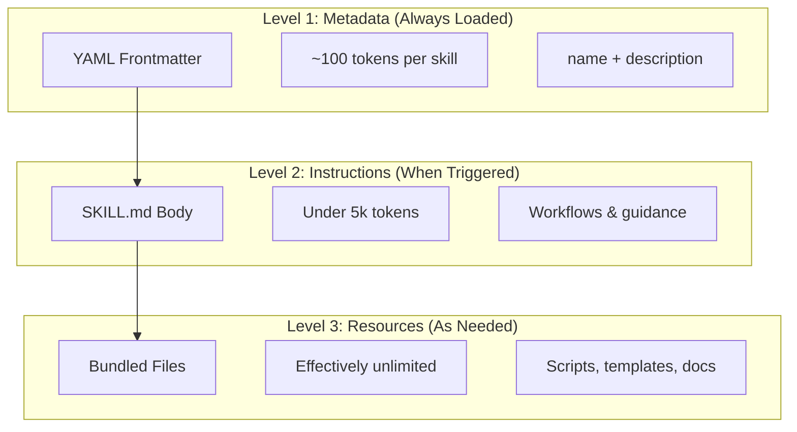
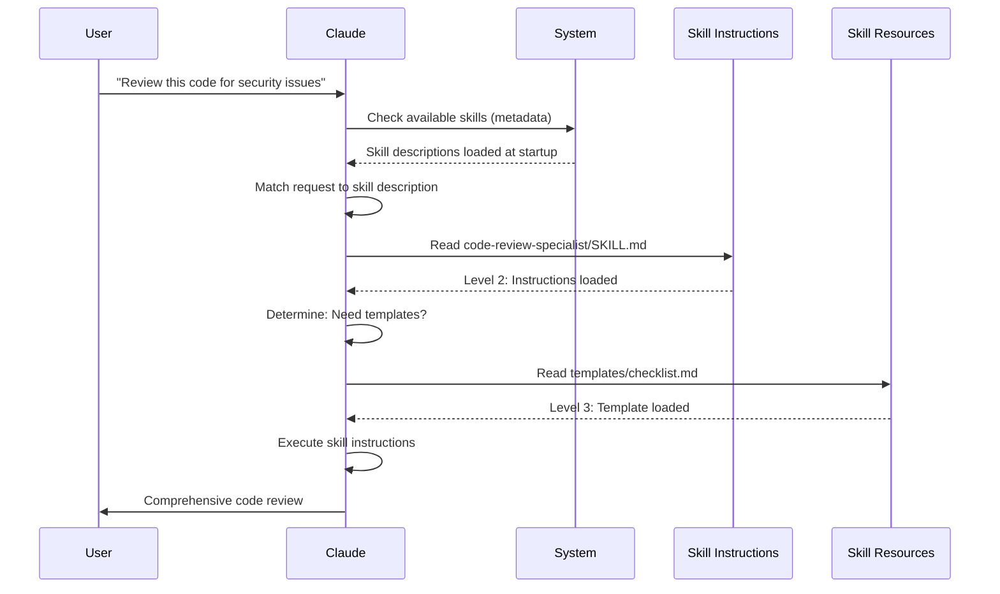

# Agent Skills Guide

Agent Skills are reusable, filesystem-based capabilities that extend Claude's functionality. They package domain-specific expertise, workflows, and best practices into discoverable components that Claude automatically uses when relevant.

## Overview

**Agent Skills** are modular capabilities that transform general-purpose agents into specialists. Unlike prompts (conversation-level instructions for one-off tasks), Skills load on-demand and eliminate the need to repeatedly provide the same guidance across multiple conversations.

### Key Benefits

- **Specialize Claude**: Tailor capabilities for domain-specific tasks
- **Reduce repetition**: Create once, use automatically across conversations
- **Compose capabilities**: Combine Skills to build complex workflows
- **Scale workflows**: Reuse skills across multiple projects and teams
- **Maintain quality**: Embed best practices directly into your workflow

Skills follow the [Agent Skills](https://agentskills.io) open standard, which works across multiple AI tools. Claude Code extends the standard with additional features like invocation control, subagent execution, and dynamic context injection.

<br/>
<br/>

---
## How Skills Work: Progressive Disclosure

Skills leverage a **progressive disclosure** architecture—Claude loads information in stages as needed, rather than consuming context upfront. This enables efficient context management while maintaining unlimited scalability.

### Three Levels of Loading



| Level | When Loaded | Token Cost | Content |
|-------|------------|------------|---------|
| **Level 1: Metadata** | Always (at startup) | ~100 tokens per Skill | `name` and `description` from YAML frontmatter |
| **Level 2: Instructions** | When Skill is triggered | Under 5k tokens | SKILL.md body with instructions and guidance |
| **Level 3+: Resources** | As needed | Effectively unlimited | Bundled files executed via bash without loading contents into context |

This means you can install many Skills without context penalty—Claude only knows each Skill exists and when to use it until actually triggered.

<br/>
<br/>

---

## Skill Loading Process



<br/>
<br/>

---

## Skill Types & Locations

| Type | Location | Scope | Shared | Best For |
|------|----------|-------|--------|----------|
| **Enterprise** | Managed settings | All org users | Yes | Organization-wide standards |
| **Personal** | `~/.claude/skills/<skill-name>/SKILL.md` | Individual | No | Personal workflows |
| **Project** | `.claude/skills/<skill-name>/SKILL.md` | Team | Yes (via git) | Team standards |
| **Plugin** | `<plugin>/skills/<skill-name>/SKILL.md` | Where enabled | Depends | Bundled with plugins |

When skills share the same name across levels, higher-priority locations win: **enterprise > personal > project**. Personal skills override project ones by default; the `skillOverrides` setting (v2.1.129+) tunes that behavior. Plugin skills use a `plugin-name:skill-name` namespace, so they cannot conflict.

> **Subagent skill discovery (v2.1.133+)**: Subagents now discover project, user, and plugin skills via the Skill tool the same way the main session does. Earlier versions limited subagents to their own embedded set, which meant skill+subagent workflows quietly degraded; from v2.1.133 the same skill catalog is visible to both.

### Automatic Discovery

**Nested directories**: When you work with files in subdirectories, Claude Code automatically discovers skills from nested `.claude/skills/` directories. For example, if you're editing a file in `packages/frontend/`, Claude Code also looks for skills in `packages/frontend/.claude/skills/`. This supports monorepo setups where packages have their own skills. As of v2.1.178, when a skill name collides across nested `.claude/skills/` directories, the directory **closest to your current working directory wins** — a package-level skill overrides a repo-root skill of the same name.

**`--add-dir` directories**: Skills from directories added via `--add-dir` are loaded automatically with live change detection. Any edits to skill files in those directories take effect immediately without restarting Claude Code.

**Reloading skills**: The `/reload-skills` command (added v2.1.152) re-scans all skill directories without restarting the session — useful after adding or editing a skill that isn't picked up by live detection. A `SessionStart` hook can trigger the same re-scan by returning `reloadSkills: true`.

**Description budget**: Skill descriptions (Level 1 metadata) are capped at **1% of the context window** (fallback: **8,000 characters**). If you have many skills installed, descriptions may be shortened. All skill names are always included, but descriptions are trimmed to fit. Front-load the key use case in descriptions. Override the budget with the `SLASH_COMMAND_TOOL_CHAR_BUDGET` environment variable.

<br/>
<br/>

---

## Creating Custom Skills

### Basic Directory Structure

```
my-skill/
├── SKILL.md           # Main instructions (required)
├── template.md        # Template for Claude to fill in
├── examples/
│   └── sample.md      # Example output showing expected format
└── scripts/
    └── validate.sh    # Script Claude can execute
```

### SKILL.md Format

```yaml
---
name: your-skill-name
description: Brief description of what this Skill does and when to use it
---

# Your Skill Name

## Instructions
Provide clear, step-by-step guidance for Claude.

## Examples
Show concrete examples of using this Skill.
```

### Recommended Fields

- **description** (recommended): what the Skill does AND when to use it. If omitted, Claude Code uses the first paragraph of markdown content. The combined `description` + `when_to_use` text is truncated at **1,536 characters** in the skill listing (configurable via `skillListingMaxDescChars`). This is what Claude matches on to decide when to activate the skill.
- **name** (optional): defaults to the skill's **directory name**. When supplied, it sets the display name — lowercase letters, numbers, hyphens only (max 64 characters), and cannot contain "anthropic" or "claude". For plugin skills, `name` also sets the last segment of the command.

All SKILL.md frontmatter fields are optional; `description` is the only one that is recommended.


### [Optional Frontmatter Fields](./optional-frontmatter-fields.md)


<br/>
<br/>

---

## Skill Content Types

Skills can contain two types of content, each suited for different purposes:

### Reference Content

Adds knowledge Claude applies to your current work—conventions, patterns, style guides, domain knowledge. Runs inline with your conversation context.

```yaml
---
name: api-conventions
description: API design patterns for this codebase
---

When writing API endpoints:
- Use RESTful naming conventions
- Return consistent error formats
- Include request validation
```

### Task Content

Step-by-step instructions for specific actions. Often invoked directly with `/skill-name`.

```yaml
---
name: deploy
description: Deploy the application to production
context: fork
disable-model-invocation: true
---

Deploy the application:
1. Run the test suite
2. Build the application
3. Push to the deployment target
```
<br/>
<br/>

---

## [Controlling Skill Invocation](./controlling-skill-invocation.md)


<br/>
<br/>

---

## String Substitutions

Skills support dynamic values that are resolved before the skill content reaches Claude:

| Variable | Description |
|----------|-------------|
| `$ARGUMENTS` | All arguments passed when invoking the skill |
| `$ARGUMENTS[N]` or `$N` | Access specific argument by index (0-based) |
| `${CLAUDE_SESSION_ID}` | Current session ID |
| `${CLAUDE_SKILL_DIR}` | Directory containing the skill's SKILL.md file |
| `${CLAUDE_PROJECT_DIR}` | Absolute path to the project root. Usable in the skill body and in `allowed-tools` (v2.1.196) |
| `${CLAUDE_EFFORT}` | Current effort level (`low`, `medium`, `high`, `xhigh`, or `max`). Useful for branching skill behavior: e.g., `[ "${CLAUDE_EFFORT}" = "max" ] && deep_analysis` (v2.1.120+) |
| `` !`command` `` | Dynamic context injection — runs a shell command and inlines the output |

**Example:**

```yaml
---
name: fix-issue
description: Fix a GitHub issue
---

Fix GitHub issue $ARGUMENTS following our coding standards.
1. Read the issue description
2. Implement the fix
3. Write tests
4. Create a commit
```

Running `/fix-issue 123` replaces `$ARGUMENTS` with `123`.

### Stacking Skills

You can stack slash-skills in a single invocation, like `/code-review /fix-issue 123`. As of v2.1.199, this loads ALL leading skills — the first plus up to 5 more — and passes the trailing arguments (`123`) to each; previously only the first skill loaded. If the same skill is invoked more than once, its identical content is de-duplicated (v2.1.202) rather than appended twice.


<br/>
<br/>

---

## Running Skills in Subagents

Add `context: fork` to run a skill in an isolated subagent context. The skill content becomes the task for a dedicated subagent with its own context window, keeping the main conversation uncluttered. As of v2.1.218, `background` defaults to `true` for `context: fork` skills, so they run in the background; set `background: false` in the frontmatter to run a fork skill in the foreground instead.

The `agent` field specifies which agent type to use:

| Agent Type | Best For |
|---|---|
| `Explore` | Read-only research, codebase analysis |
| `Plan` | Creating implementation plans |
| `general-purpose` | Broad tasks requiring all tools |
| Custom agents | Specialized agents defined in your configuration |

The `model` field can peg the model that you can run this under.

**Example frontmatter:**

```yaml
---
context: fork
agent: Explore
---
```

**Full skill example:**

```yaml
---
name: topic-research
description: Research a topic thoroughly
context: fork
agent: Explore
---

Research $ARGUMENTS thoroughly:
1. Find relevant files using Glob and Grep
2. Read and analyze the code
3. Summarize findings with specific file references
```

## [Practical Examples](./practical-examples.md)


<br/>
<br/>

---

## Managing Skills

### Viewing Available Skills

Ask Claude directly:
```
What Skills are available?
```

Or check the filesystem:
```bash
# List personal Skills
ls ~/.claude/skills/

# List project Skills
ls .claude/skills/
```

### Testing a Skill

Two ways to test:

**Let Claude invoke it automatically** by asking something that matches the description:
```
Can you help me review this code for security issues?
```

**Or invoke it directly** with the skill name:
```
/code-review-specialist src/auth/login.ts
```

### Updating a Skill

Edit the `SKILL.md` file directly, then run `/reload-skills` (v2.1.152+) to re-scan the skill directories. Restarting Claude Code also works, but is not required — skills in `--add-dir` directories are picked up live, and a `SessionStart` hook returning `reloadSkills: true` triggers the same re-scan.

```bash
# Personal Skill
code ~/.claude/skills/my-skill/SKILL.md

# Project Skill
code .claude/skills/my-skill/SKILL.md
```


<br/>
<br/>

---

## Best Practices

### 1. Make Descriptions Specific

- **Bad (Vague)**: "Helps with documents"
- **Good (Specific)**: "Extract text and tables from PDF files, fill forms, merge documents. Use when working with PDF files or when the user mentions PDFs, forms, or document extraction."

### 2. Keep Skills Focused

- One Skill = one capability
- ✅ "PDF form filling"
- ❌ "Document processing" (too broad)

### 3. Include Trigger Terms

Add keywords in descriptions that match user requests:
```yaml
description: Analyze Excel spreadsheets, generate pivot tables, create charts. Use when working with Excel files, spreadsheets, or .xlsx files.
```

### 4. Keep SKILL.md Under 500 Lines

Move detailed reference material to separate files that Claude loads as needed.

### 5. Reference Supporting Files

```markdown
## Additional resources

- For complete API details, see [reference.md](reference.md)
- For usage examples, see [examples.md](examples.md)
```

### Do's

- Use clear, descriptive names
- Include comprehensive instructions
- Add concrete examples
- Package related scripts and templates
- Test with real scenarios
- Document dependencies

### Don'ts

- Don't create skills for one-time tasks
- Don't duplicate existing functionality
- Don't make skills too broad
- Don't skip the description field
- Don't install skills from untrusted sources without auditing


<br/>
<br/>

---

## Troubleshooting

### Quick Reference

| Issue | Solution |
|-------|----------|
| Claude doesn't use Skill | Make description more specific with trigger terms |
| Skill file not found | Verify path: `~/.claude/skills/name/SKILL.md` |
| YAML errors | Check `---` markers, indentation, no tabs |
| Skills conflict | Use distinct trigger terms in descriptions |
| Scripts not running | Check permissions: `chmod +x scripts/*.py` |
| Claude doesn't see all skills | Too many skills; check `/context` for warnings |

### Skill Not Triggering

If Claude doesn't use your skill when expected:

1. Check the description includes keywords users would naturally say
2. Verify the skill appears when asking "What skills are available?"
3. Try rephrasing your request to match the description
4. Invoke directly with `/skill-name` to test

### Skill Triggers Too Often

If Claude uses your skill when you don't want it:

1. Make the description more specific
2. Add `disable-model-invocation: true` for manual-only invocation

### Claude Doesn't See All Skills

Skill descriptions are loaded at **1% of the context window** (fallback: **8,000 characters**). Each entry is capped at 250 characters regardless of budget. Run `/context` to check for warnings about excluded skills. Override the budget with the `SLASH_COMMAND_TOOL_CHAR_BUDGET` environment variable.


<br/>
<br/>

---

## Skills vs Other Features

| Feature | Invocation | Best For |
|---------|------------|----------|
| **Skills** | Auto or `/name` | Reusable expertise, workflows |
| **Slash Commands** | User-initiated `/name` | Quick shortcuts (merged into skills) |
| **Subagents** | Auto-delegated | Isolated task execution |
| **Memory (CLAUDE.md)** | Always loaded | Persistent project context |
| **MCP** | Real-time | External data/service access |
| **Hooks** | Event-driven | Automated side effects |

<br/>
<br/>

---

- [Injecting Dynamic Content](./injecting-dynamic-context.md)
- [Security Considerations](security-considerations.md)
- [Bundled Skills](bundled-skills.md)
- [Sharing Skills](./sharing-skills.md)


<br/>
<br/>

---

## Additional Resources

- [Official Skills Documentation](https://code.claude.com/docs/en/skills)
- [Agent Skills Architecture Blog](https://claude.com/blog/equipping-agents-for-the-real-world-with-agent-skills)
- [Skills Repository](https://github.com/luongnv89/skills) - Collection of ready-to-use skills

---

**Last Updated**: September 2, 2026
**Claude Code Version**: 2.1.257
**Sources**:
- https://code.claude.com/docs/en/skills
- https://github.com/anthropics/claude-code/blob/main/CHANGELOG.md
- https://code.claude.com/docs/en/model-config
**Compatible Models**: Claude Fable 5, Claude Opus 5, Claude Sonnet 5, Claude Sonnet 4.6, Claude Opus 4.8, Claude Haiku 4.5
